<div align="center">

</div>

---

<div align="center">*In Japanese, 'ouchi' (おうち) means 'home' and 'taiko' (太鼓) means 'drum.' Together, 'OuchiTaiko' represents<br> 
the joy of bringing the authentic Taiko experience from the Arcade into your own space.*</div>

---
<br>
Table of Contents

- [1: Project Overview](#1-project-overview)
- [2: Parts List for Electronics](#2-parts-list-for-electronics)
- [3: Parts List for Hardware](#3-parts-list-for-hardware)
- [4: Build the Circuit](#4-build-the-circuit)
- [5: Build the Drum](#5-build-the-drum)
- [6: Control Box](#6-control-box)
- [7: Flash The Firmware](#7-flash-the-firmware)
- [8: Calibration & Setup](#8-calibration--setup)
- [9: Files & Downloads](#9-files--downloads)
- [10: Basic Troubleshooting](#10-basic-troubleshooting)
- [11: About](#11-about)
- [12: Copyright Information](#12-copyright-information)

---

## 1: Project Overview

<div align="right"><sub><a href="#table-of-contents">↑ Back to Top</a></sub></div>

<div align="center">
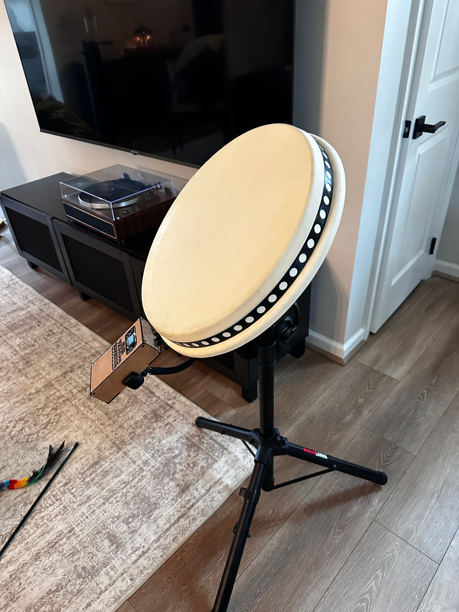
</div>
<div align="center">
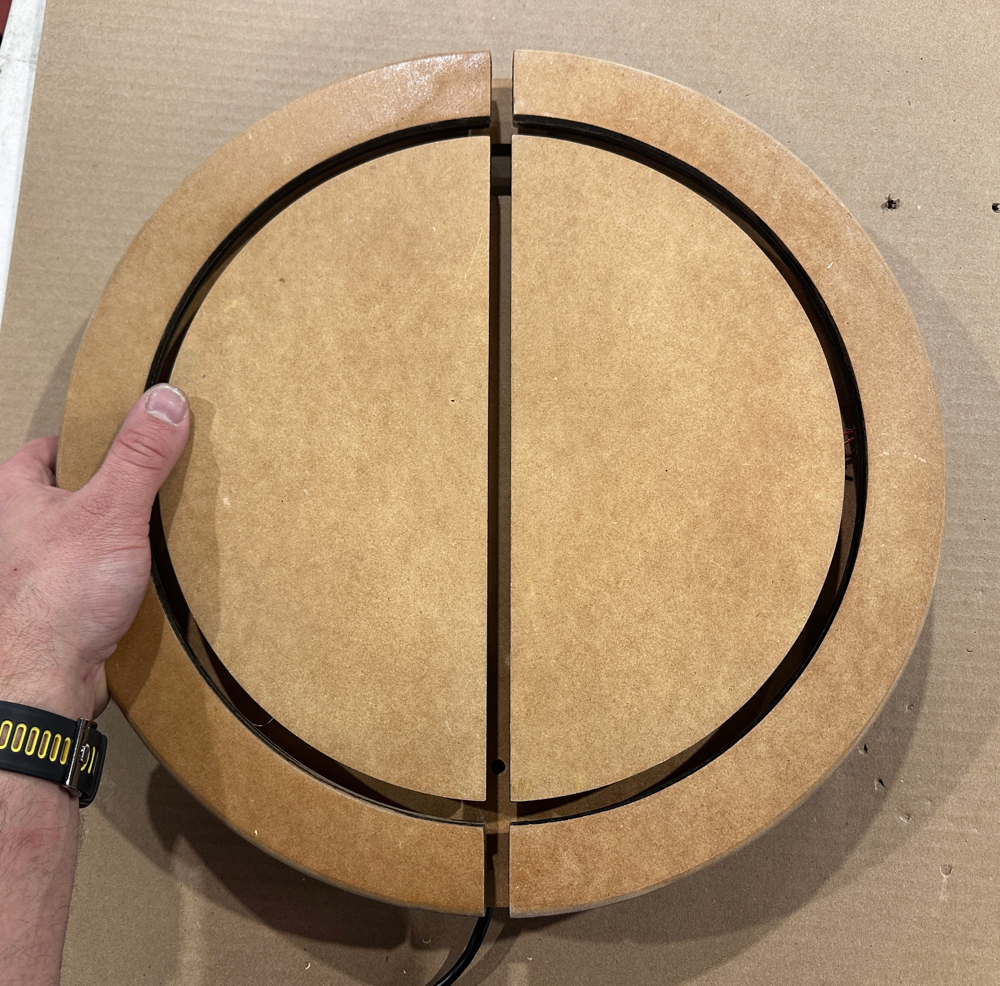
</div>
<div align="center">
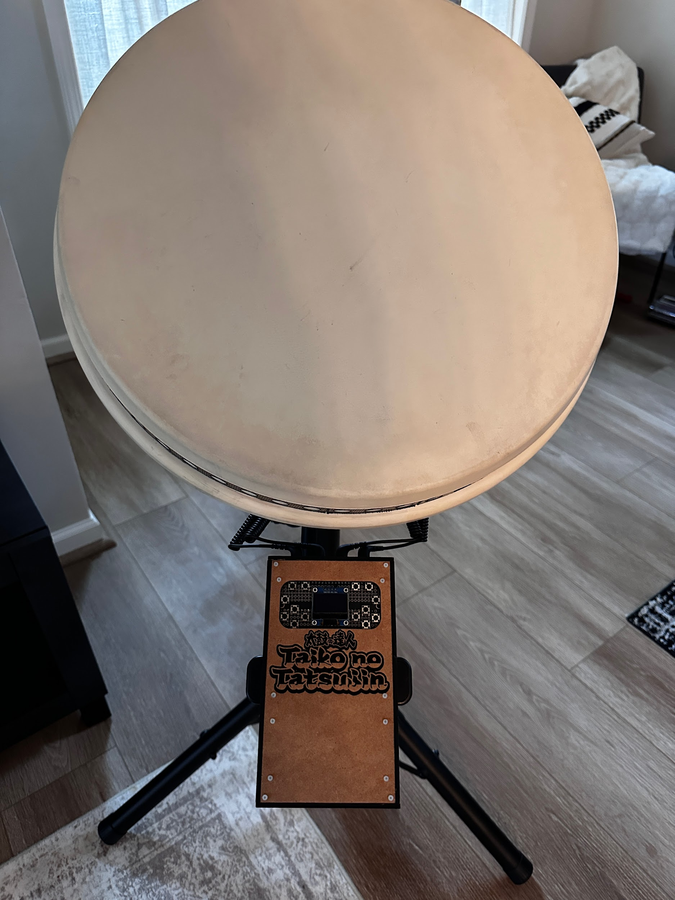
</div>

**Congratulations!** 

Welcome to "KillerQ's OuchiTaiko Project: Arcade Controller Build Guide." You're about to build the most functional and comprehensive arcade-scale home Taiko drum controller ever designed. This open-source guide represents 8 months of research and development, bringing the authentic arcade experience home without the high cost.

The OuchiTaiko Project features a pioneering adaptive drum design—the first of its kind for any home arcade controller—addressing the limited availability and high cost of commercial units.

**Smarter. Simpler. Better.**

Instead of complex analog circuits with operational amplifiers and custom PCBs, this design uses adaptive software intelligence to achieve superior performance through elegant simplicity.

All you need is enthusiasm and basic soldering and woodworking skills. The components linked in this guide create a perfectly functional controller when used together. Feel free to substitute compatible alternatives if you find cheaper options that achieve the same results.

### What You'll Build: Next-Generation Features

You will construct a professional arcade-scale Taiko drum controller engineered for premium performance and maximum compatibility, featuring:


<b>📋 Unprecedented Performance & Design</b>

- **4 Velocity-Sensitive Zones:** Enhanced mechanical and electronic false-trigger isolation
- **Custom Arcade Sensors:** Drum trigger sensors with custom-designed suspension mounting that precisely mimics Japanese arcade machines (a first time available to the Public)
- **Adaptive Baseline Technology:** Custom-designed velocity-sensing for automatic sensitivity adjustment (a first for any home arcade controller) as well as authentic scoring by hitting big Notes *harder*
- **Zero Coding Required:** Drag-and-drop firmware for simple setup


<b>🔧 Advanced Hardware & Connectivity</b>

**OLED Display:** On-the-fly mode selection, settings, calibration, and real-time hit feedback

**IDLE SCREEN SHOWS:**
- Controller mode (top)
- Streak counter (live roll count)
- 4 animated characters (react to hits)
- Player LEDs (PS4 mode, top-right)
- Menu hint (bottom)

**VISUAL FEEDBACK:**
- Each character = one drum pad (left to right: Ka L, Don L, Don R, Ka R)
- Characters squish when hit
- 60fps smooth animation
- Instant hit confirmation

**HARDWARE:**
- **14 Navigation Buttons:** Full in-game navigation regardless of game version
- **Built-in 3.5mm Headphone Jack:** Lag-free audio right at the drum
- **Professional Mounting:** Optimal hardware stabilization via adjustable, angled speaker stand
- **Performance:** Rivals high-end manufactured controllers and commercial Arcade units


<b>🎮 14 Input Modes for Maximum Compatibility</b>

- Nintendo Switch Tatacon (HORI NSW-079 Taiko Drum)
- Nintendo Switch Pro Controller
- Sony PS3 Dualshock3
- Sony PS4 Tatacon Drum (HORI PS4-095 Taiko Drum)
- Sony PS4 Dualshock4 (PC/Steam only)
- Keyboard Player 1
- Keyboard Player 2
- Microsoft Xbox Xbox360 (XInput)(Compatible with TaikoArcadeLoader)
- Android (XInput)
- iOS (XInput)
- Analog Player 1 (XInput)(Compatible with TaikoArcadeLoader)
- Analog Player 2 (XInput)(Compatible with TaikoArcadeLoader)
- MIDI Controller
- Debug Mode


### 🎥 Demo Videos

- [Finished Drum](https://youtu.be/Ji3sOdRHO0Q)
- [Some Gameplay](https://youtu.be/p4eFeo_LB5I?si=jDKb93B7uYx1qAux)
- [Roll Polling Rate Demo](https://youtu.be/wEw9HbGcR-s)
- [Hit Velocity Detection](https://www.youtube.com/watch?v=wceSXgtBcfE)

---

## 2: Parts List for Electronics

<div align="right"><sub><a href="#table-of-contents">↑ Back to Top</a></sub></div>

The Amazon links reference parts that are 100% compatible when used together. You can source these items from any supplier as long as they meet the specifications.

**Important:** "Quantity" refers to the number of individual items you need, NOT the package size sold at the link. For example, this project requires 4 individual 27mm piezo sensors, but the Amazon link sells a 20-pack.


<div style="overflow-x: auto;">

|# |Item                                                         |Qty|Product Link                  |
|--|-------------------------------------------------------------|---|------------------------------|
|1 |XIAO RP2040 board (Seeed Studio)                             |1  |[Link](https://a.co/d/g9dFG88)|
|2 |MCP23017 I2C expander Board                                  |1  |[Link](https://a.co/d/er7ux8r)|
|3 |1N4148 diodes                                                |4  |[Link](https://a.co/d/jlNKdaJ)|
|4 |100nF capacitor (same as 0.1 µf)                             |4  |[Link](https://a.co/d/fP04dyW)|
|5 |3.5mm TRS FEMALE jacks w/ screw terminals                    |4  |[Link](https://a.co/d/2umR9us)|
|6 |3.5mm TRS male w/ standard ends                              |4  |[Link](https://a.co/d/414YG9z)|
|7 |27mm Piezo sensors                                           |4  |[Link](https://a.co/d/hbacbaF)|
|8 |128x64 Mono OLED display (I2C)                               |1  |[Link](https://a.co/d/bHAtiY2)|
|9 |Tactile buttons (6mm or your choice)                         |14 |[Link](https://a.co/d/2j6JNsp)|
|10|22 AWG Siamese wire                                          |1  |[Link](https://a.co/d/0pGa2wH)|
|11|Small USB-A hub (2+ ports)                                   |1  |[Link](https://a.co/d/4vWTHAC)|
|12|USB Audio DAC with 3.5mm output (32-bit, 48kHz)              |1  |[Link](https://a.co/d/au4BLDH)|
|13|6 inch 3.5mm TRS audio extension cable (Male to Female)      |1  |[Link](https://a.co/d/cesBnrm)|
|14|USB-A to USB-C converter                                     |1  |[Link](https://a.co/d/bG4QJUF)|
|15|Short USB-C to USB-A extension cable                         |1  |[Link](https://a.co/d/d61CuLt)|
|16|6 inch, coiled 3.5mm TRS audio extension cable (Male to Male)|4  |[Link](https://a.co/d/cSKAJ7D)|
|17|3.5mm TRS barrel coupler                                     |4  |[Link](https://a.co/d/fOiYb5s)|
|18|JST-XH 2.54mm Pitch connector kit                            |1  |[Link](https://a.co/d/11FXUlI)|
|19|22 AWG Connection Ribbon Wire                                |1  |[Link](https://a.co/d/1D5mJ8Z)|
|20|2.54mm pitch Header Pins                                     |1  |[Link](https://a.co/d/6D4ftKM)|
|21|Female DuPont connector wires                                |1  |[Link](https://a.co/d/a7tXZma)|
|22|Blank Protoboard Circuit Boards                              |3  |[Link](https://a.co/d/2yOqCkd)|
|23|10ft USB-C to USB-C Cable                                    |1  |[Link](https://a.co/d/6F0Ic5R)|

</div>


---

## 3: Parts List for Hardware

<div align="right"><sub><a href="#table-of-contents">↑ Back to Top</a></sub></div>

The Amazon links reference parts that are 100% compatible when used together. You can source these items from any supplier as long as they meet the specifications.

**Important:** "Quantity" refers to the number of individual items you need, NOT the package size sold at the link.

### Required Tools and Supplies


This guide assumes you have access to the following:

1. Laser cutter or CNC machine (or other means to cut wood)
2. Soldering iron and solder
3. Wire strippers/cutters
4. Screwdrivers
5. Hot glue gun
6. Strong clamps
7. Drill
8. Router
9. Sandpaper
10. Utility knife
11. Rubber mallet


### Hardware Parts List


<div style="overflow-x: auto;">

|# |Item                                                                                                                                       |Qty|Product Link                                                                                                                       |
|--|-------------------------------------------------------------------------------------------------------------------------------------------|---|-----------------------------------------------------------------------------------------------------------------------------------|
|1 |6mm Cabinet-Grade MDF (1/4 inch thick works too). Amount needed dictated by sizes in SVG files                                             |1  |[Home Depot](https://www.homedepot.com/p/1-4-in-x-2-ft-x-4-ft-Medium-Density-Fiberboard-1508104/202089069) or call local lumberyard|
|2 |Strong Wood Glue                                                                                                                           |1  |[Link](https://a.co/d/1uKv6cR)                                                                                                     |
|3 |M3x8mm bolts                                                                                                                               |8  |[Link](https://a.co/d/52Q8UtD)                                                                                                     |
|4 |M3x5mm threaded inserts                                                                                                                    |8  |[Link](https://a.co/d/bKB6OpW)                                                                                                     |
|5 |M6x10mm wood threaded inserts                                                                                                              |14 |[Link](https://a.co/d/jhY5rYA)                                                                                                     |
|6 |M6x20mm nylon bolts                                                                                                                        |14 |[Link](https://a.co/d/bPitQiX)                                                                                                     |
|7 |M6 threaded 20mmx15mm rubber isolators (one side M6 Female, other side with M6x18mm bolt)                                                  |14 |[Link](https://a.co/d/9dWHezk)                                                                                                     |
|8 |3D printer filament (PLA)                                                                                                                  |1  |[Link](https://a.co/d/7cCSDtJ)                                                                                                     |
|9 |Gel Superglue                                                                                                                              |1  |[Link](https://a.co/d/dxU7lfw)                                                                                                     |
|10|Loctite thread adhesive - Medium                                                                                                           |1  |[Link](https://a.co/d/2W890aJ)                                                                                                     |
|11|2.2mm thick Scuba Knit Neoprene fabric (only 4"x4" total needed)                                                                           |1  |[Link](https://a.co/d/dfMhZ4k)                                                                                                     |
|12|Finger Knobs with pass-through M6 threads                                                                                                  |18 |[Link](https://a.co/d/hjL3QQP)                                                                                                     |
|13|Mini PA speaker stand (or a stand with a compliant interface that matches your mount below)                                                |1  |[Link](https://a.co/d/2YkmhPj)                                                                                                     |
|14|Adjustable Angle Speaker bracket (or a compliant interface that matches your stand above)                                                  |1  |[Link](https://a.co/d/gQioU8i)                                                                                                     |
|15|Rubber Taiko Drum Cover (optional but crucial for Arcade feel. Any thin sound-dampening material with bounce works: towel, mouse pad, etc.)|1  |[Link](https://taiko.ac/products/rubber-drum-pad)                                                                                  |

</div>


---

## 4: Build the Circuit

<div align="right"><sub><a href="#table-of-contents">↑ Back to Top</a></sub></div>


🎥 [Video overview of circuit building process](https://youtu.be/Zif1cv-oa6k)

This guide states the core objective of each step and provides example approaches through photos. Multiple layouts and methods can work.

**Critical:** Use a multimeter to test continuity as you go. A two-second check can save hours of troubleshooting caused by a poor solder joint or loose wire.

Review all steps, videos, and images before beginning to allow for optimal planning. This guide provides a 100% working system when followed as-is. However, as long as you adhere to the electrical theory and circuit structure, you can adjust and use creative freedom according to your comfort level.

### Circuit Overview

The Seeed Studio XIAO RP2040 board is the brain, power source, and host for the drum panel sensors. The external MCP23017 board handles the OLED display and navigation buttons.

### Tips for Success

- Use color-coded wires for easy identification
- Test each phase with a multimeter for continuity before proceeding
- Label everything during assembly
- Take time with soldering connections

### Circuit Diagram

<div align="center">
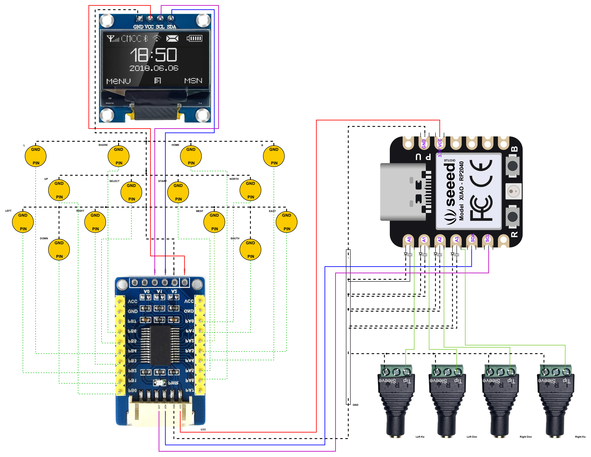
</div>

**Note:** The MCP23017 board in this diagram is flipped horizontally to represent it being mounted on the opposite side of the circuit board from the buttons — that is why the lettering is reversed. All connections are labeled correctly, the characters themselves are just mirrored.

💾 [Download full-resolution Circuit Diagram PDF](https://ouchitaikoproject.github.io/OuchiTaikoProject/DownloadFiles/KillerQsOuchiTaikoProjectCircuitSchematic.pdf)

<div align="center">
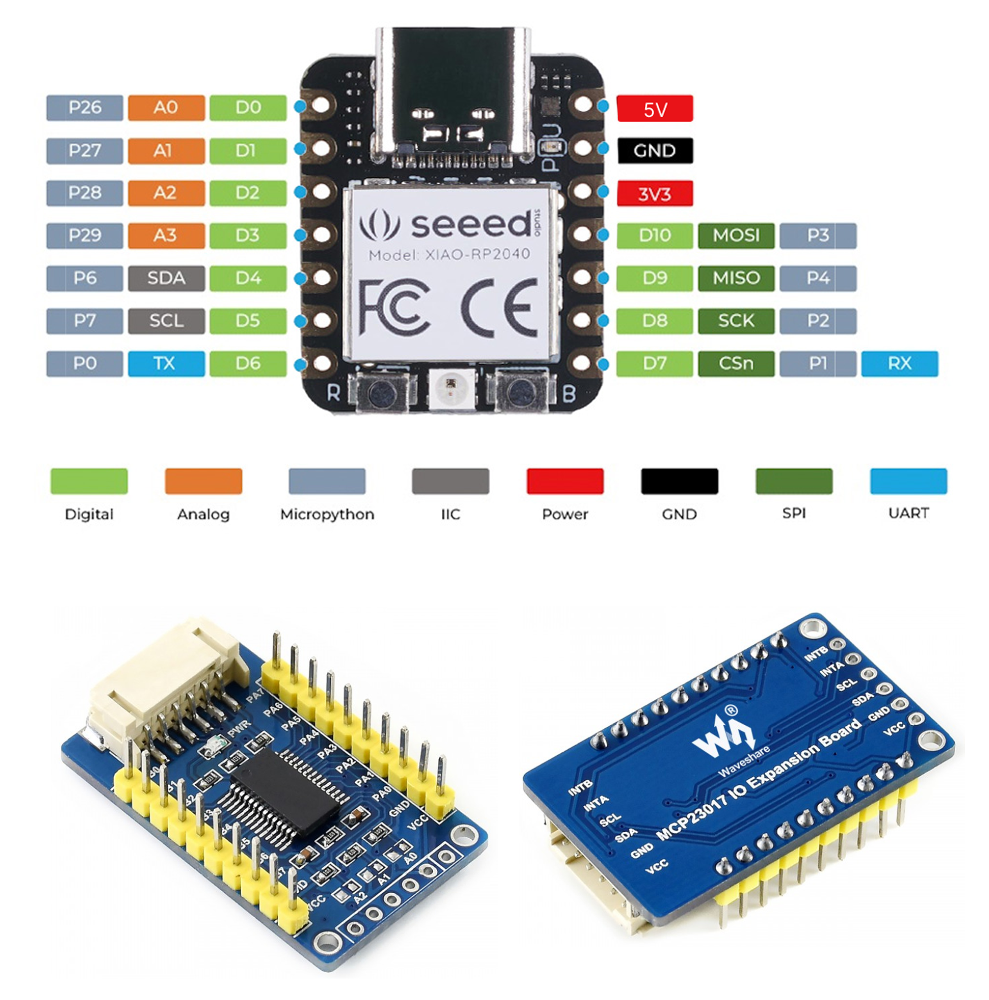
</div>

*(Enlarged Pin-outs of the main boards for easy reference)*

---

### A: XIAO Board Trigger Circuit

<div align="right"><sub><a href="#table-of-contents">↑ Back to Top</a></sub></div>

💾 [The full-resolution circuit schematic can be downloaded here](https://ouchitaikoproject.github.io/OuchiTaikoProject/DownloadFiles/KillerQsOuchiTaikoProjectCircuitSchematic.pdf)

---

### **<u>A1. Mount the XIAO RP2040 to a blank circuit board</u>**

You will be soldering multiple components to the same pins, leaving ample space and utilization of the shared rows will help.

<div align="center">
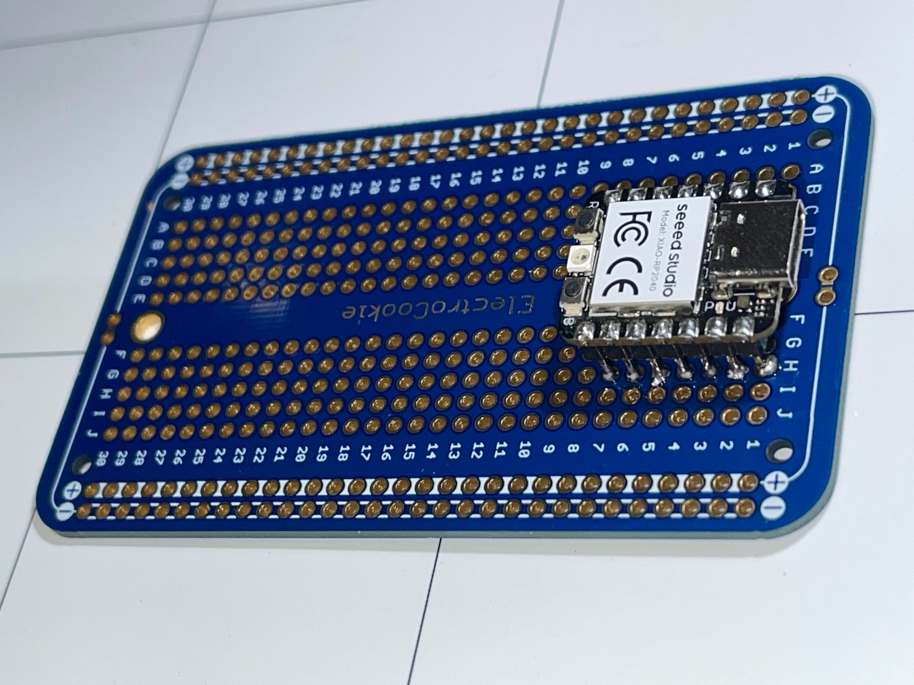
</div>

---

### **<u>A2. Connect the GND pin on the XIAO RP2040 to the common ground rail of the protoboard</u>**

Be sure that the GND rails on both sides of the board are connected to each other. Some boards require a solder bridge to achieve this.

---

### **<u>A3. Connect the VCC 3.3V pin on the XIAO RP2040 to the common VCC power rail of the protoboard</u>**

Be sure that the VCC rails on both sides of the board are connected to each other. Some boards require a solder bridge to achieve this.

---

### **<u>A4. Pin "P26" (Left Ka):</u>**

1. Solder the anode end (the side *without* the stripe) of a 1N4148 diode to pin A0/P26
2. Solder the opposite, *striped* end (cathode) of the diode to the common ground rail as close to the pin as possible
3. Solder one end of a 100nF capacitor to pin A0/P26 (no polarity here, either end is fine)
4. Solder the other end of the 100nF capacitor to the common ground rail as close to the pin as possible
5. Connect a yellow signal wire from pin A0/P26 to the *TIP* terminal of TRS Jack 1 (Left Ka)
6. Connect a black GND wire between the common ground rail and the SLEEVE terminal of TRS Jack 1

<div align="center">
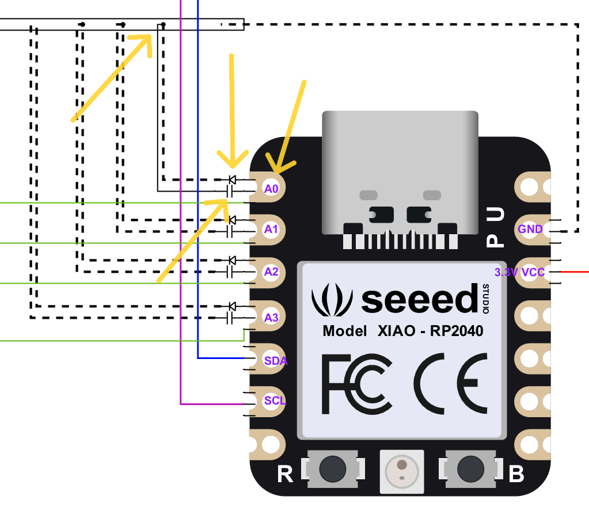
</div>

<div align="center">
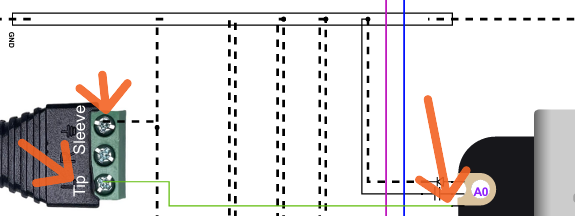
</div>

The photos below show several variants of connecting the capacitors and diodes.

This example has the diodes on top of the board and the capacitors on the underside to allow more room to work:

<div align="center">
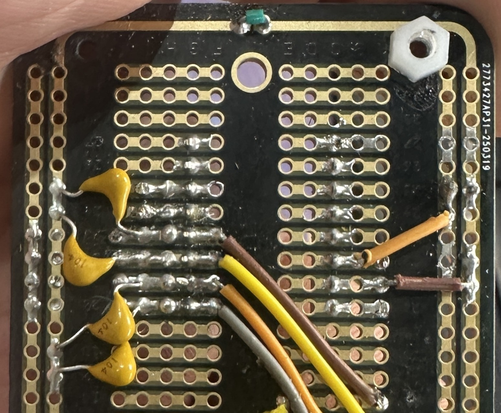
</div>
<div align="center">
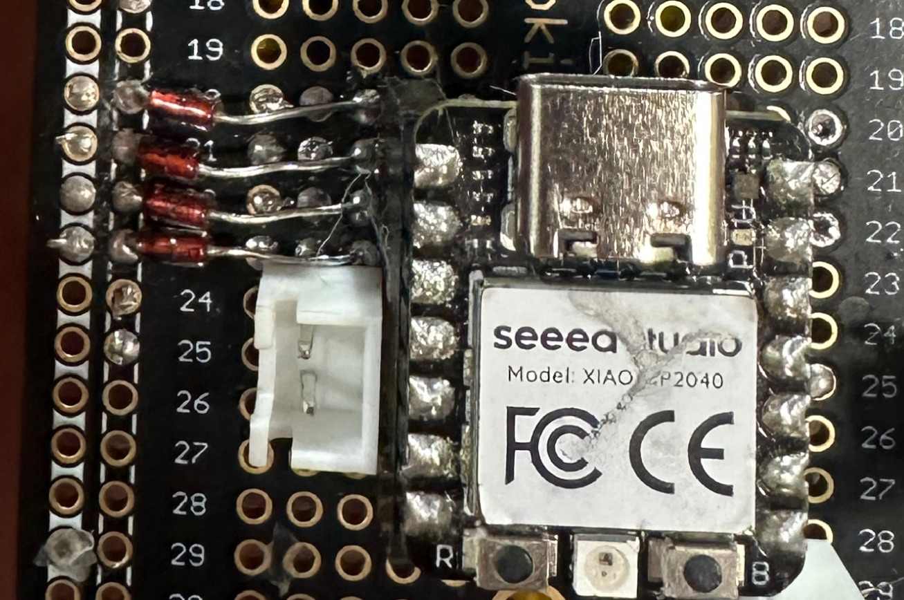
</div>

<div align="right"><sub><a href="#table-of-contents">↑ Back to Top</a></sub></div>

This example puts both the capacitor and diode on the top side of the board. Side note: this example also uses JST connectors to allow for modular connections of the TRS input jacks, so they are easily removable from the board (optional):

<div align="center">
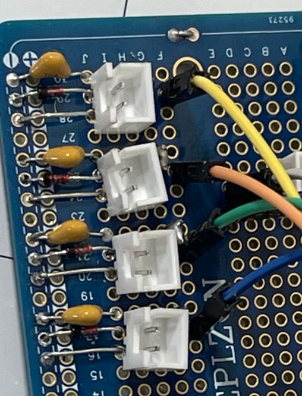
</div>

This is an example of a removable TRS input jack using a JST connection:

<div align="center">
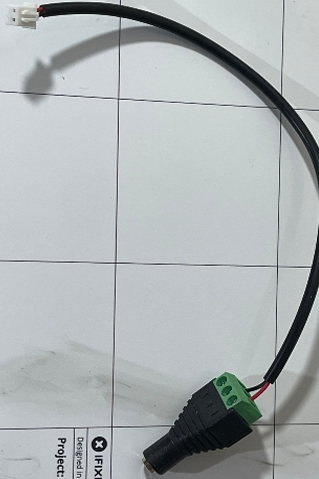
</div>

---

**Repeat the exact same 6-step process from A4 above for each of the three remaining analog pins. Use the following pin assignments and wire colors:**

<div style="overflow-x: auto;">

|Step|Pin   |Drum Zone|Signal Wire Color|TRS Jack #|
|----|------|---------|-----------------|----------|
|A5  |A1/P27|Left Don |Orange           |Jack 2    |
|A6  |A2/P28|Right Don|Green            |Jack 3    |
|A7  |A3/P29|Right Ka |Blue             |Jack 4    |

</div>

**Summary: For each pin, complete these steps:**

1. Solder 1N4148 diode (anode to pin, cathode to ground)
2. Solder 100nF capacitor (one end to pin, other end to ground)
3. Connect colored signal wire from pin to TRS Jack TIP terminal
4. Connect black wire from ground rail to TRS Jack SLEEVE terminal

---

### I2C Control Board Circuit Mounting and Power

<div align="right"><sub><a href="#table-of-contents">↑ Back to Top</a></sub></div>

### **<u>A8. Mount the MCP23017 GPIO Expander on a blank board</u>**

Mount the MCP23017 GPIO Expander on a blank board that is large enough to also house the OLED display and navigation buttons (buttons added later in this guide). In the below photo, the MCP23017 is mounted on the rear of the board.

This board will house the display and buttons for the navigation. Plan enough space accordingly. 

Connect the wiring harness that came with with the MCP23017 board, and clip wires number 5 and 6 off. You will only be using the first 4 wires on this harness (red, black, blue, and yellow).

<div align="center">
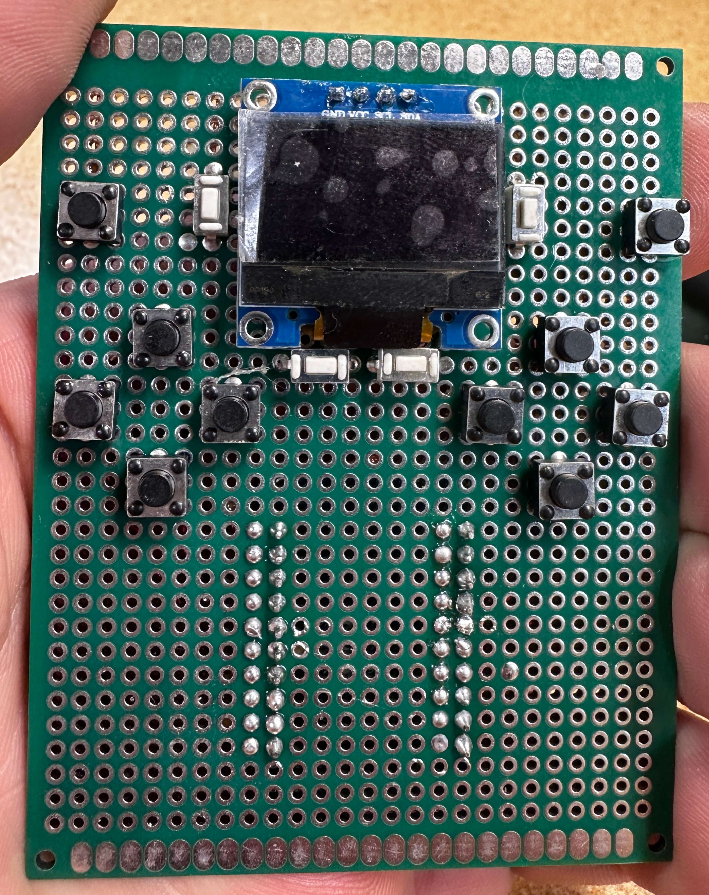
</div>
<div align="center">
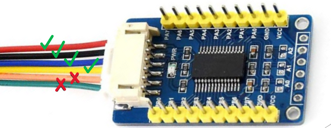
</div>
---

### **<u>A9. Connect Power</u>**

Using the wires from the harness you just plugged in, connect the VCC (red) wire to the VCC power rail on your main board that you built where the XIAO 2040 Board is mounted.

Now, connect the GND (black) wire from the harness to the GND rail on your main board that you built where the XIAO 2040 Board is mounted.

This 2-wire connection will be powering the MCP23017 board and will also provide pass-through power for the OLED display.

---

### MCP23017 Data Connections

**Note:** Pins A7 and B7 will *not* be used for this project.

### **<u>A10. Connect SDA</u>**

Connect the SDA (blue) wire on the MCP23017 harness to Pin 6 (SDA) on the XIAO 2040 board.

This is one of the two wires that sends the display and navigation buttons data back and forth during use.

---

### **<u>A11. Connect SCL</u>**

Connect the SCL (yellow) wire on the MCP23017 harness to Pin 7 (SCL) on the XIAO 2040 board.

This is the other of the two wires that sends the display and navigation buttons data back and forth during use.

---

### I2C OLED Display Circuit

<div align="right"><sub><a href="#table-of-contents">↑ Back to Top</a></sub></div>

### **<u>A12. Mount the OLED display</u>**

Mount the OLED display on the same board as the MCP23017 (and navigation buttons).

Reminder: this board will house the display and buttons for the gamepad navigation. Plan accordingly.

---

### **<u>A13. Connect SDA to display</u>**

Connect a wire between the SDA soldering point on the MCP23017 board (opposite end of where you plugged the harness in) and the SDA pin on the OLED Display.

<div align="center">
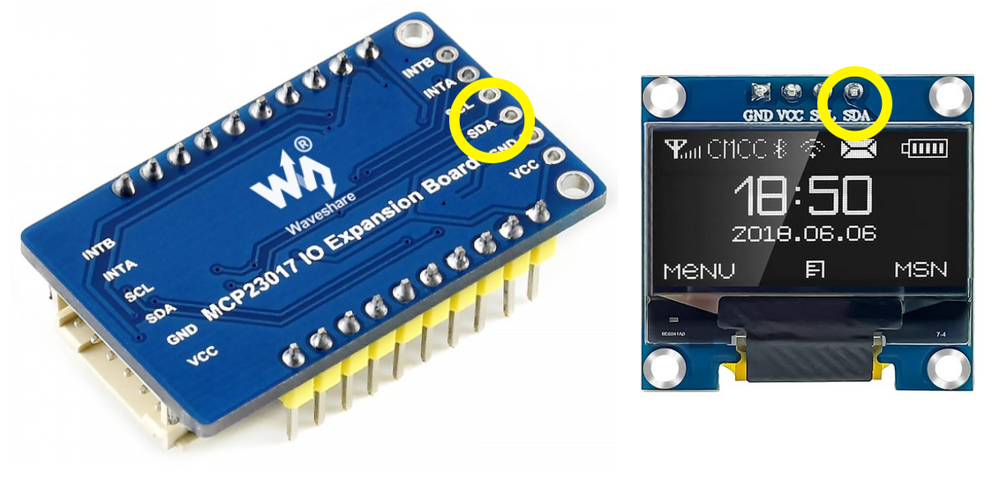
</div>

---

### **<u>A14. Connect SCL to display</u>**

Connect a wire between the SCL soldering point on the MCP23017 board (opposite end of where you plugged the harness in) and the SCL pin on the OLED Display.

<div align="center">
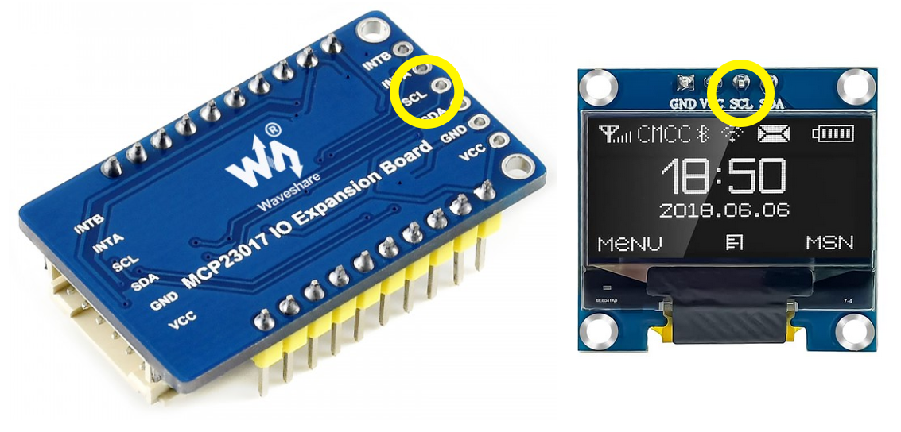
</div>

---

### **<u>A15. Connect VCC to display</u>**

Connect a wire between the VCC soldering point on the MCP23017 board (opposite end of where you plugged the harness in) and the VCC pin on the OLED Display.

<div align="center">
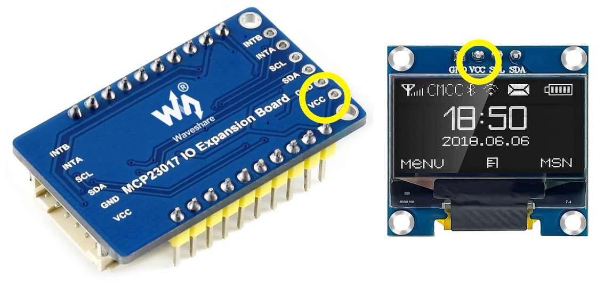
</div>

---

### **<u>A16. Connect GND to display</u>**

Connect a wire between the GND soldering point on the MCP23017 board (opposite end of where you plugged the harness in) and the GND pin on the OLED Display.

<div align="center">

</div>

---

### Navigation/Gamepad Buttons

<div align="right"><sub><a href="#table-of-contents">↑ Back to Top</a></sub></div>

### **<u>A17. Solder navigation buttons</u>**

Solder your 14 navigation buttons to your OLED circuit board in the same layout as the image to the right. This layout is similar to the traditional SWITCH Gamepad button and works best for this project.

<div align="center">
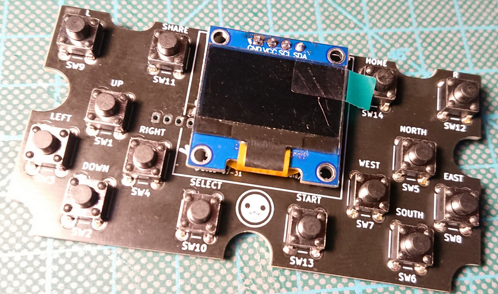
</div>
<div align="center">
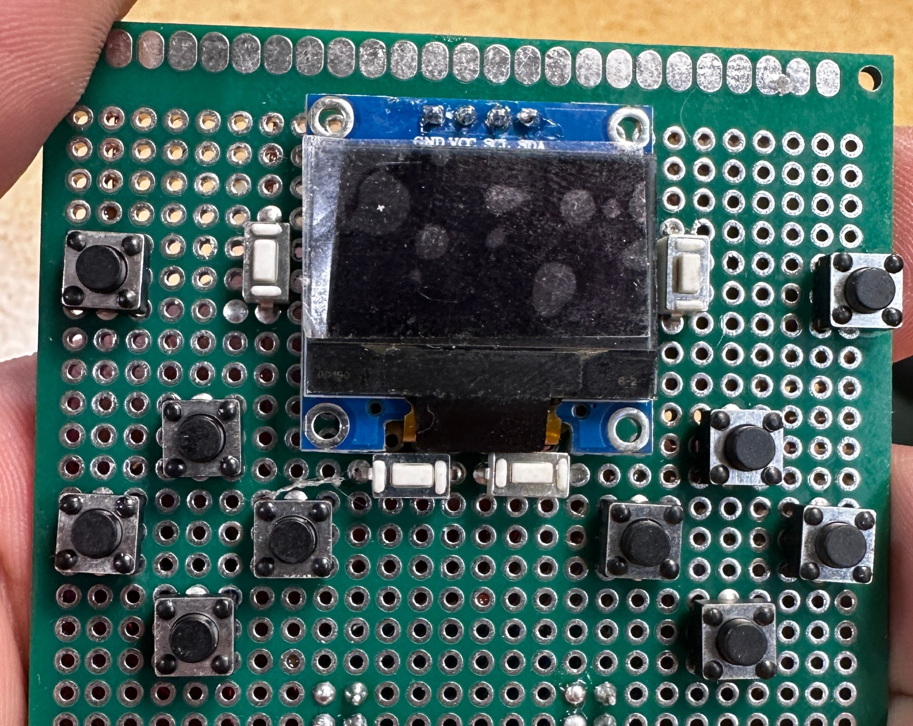
</div>


---

### **<u>A18. Connect button grounds</u>**

Connect one leg of each of the 14 buttons to the common ground rail.

You can also daisy-chain the ground wire between all buttons and then to a ground rail. Here are a few different example scenarios.

The first and second photos have all the grounds terminating at JST connectors that plug into a connector on the ground rail:

<div align="center">
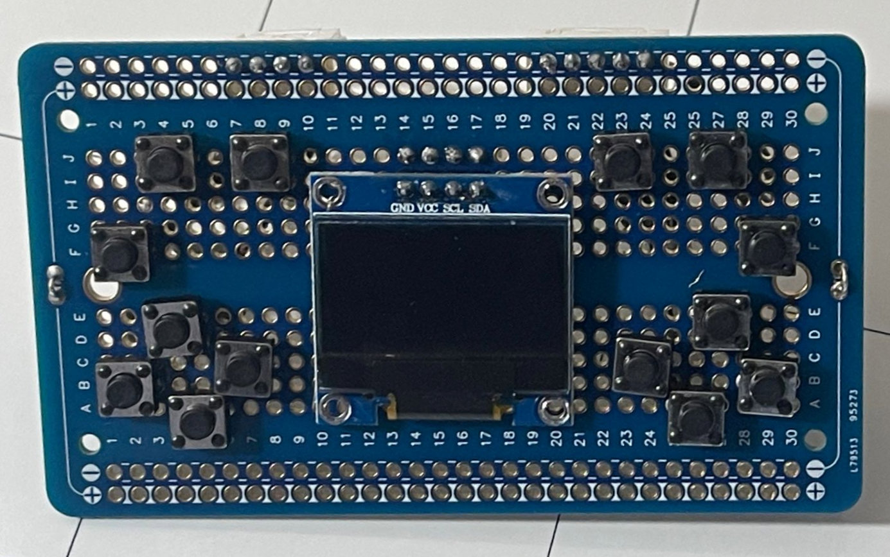
</div>
<div align="center">
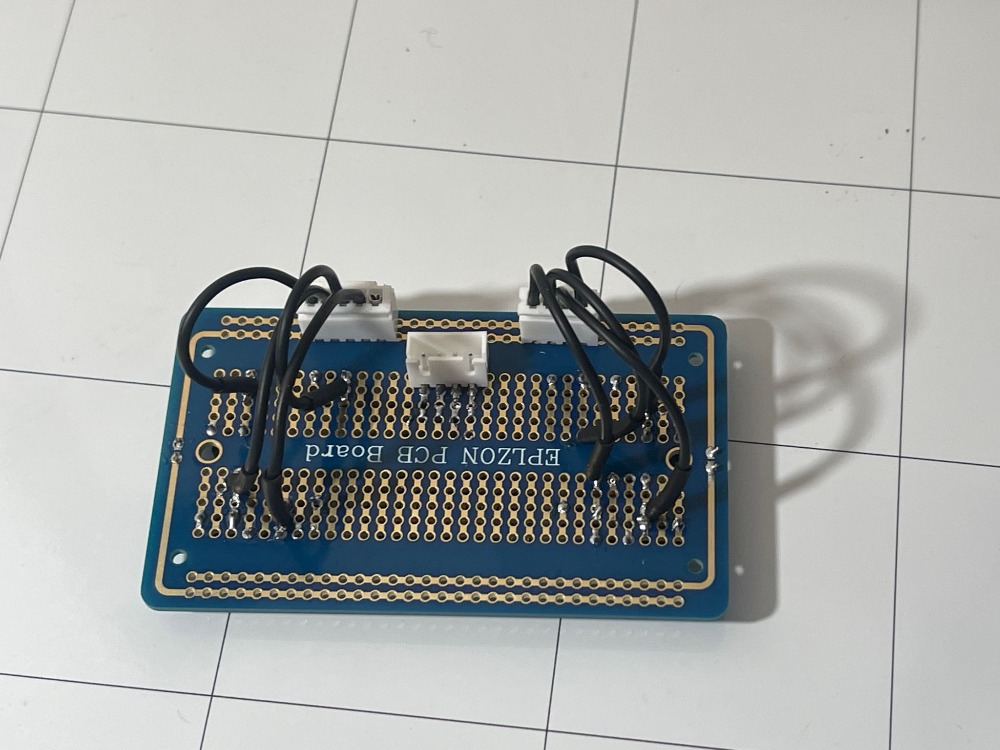
</div>

<div align="right"><sub><a href="#table-of-contents">↑ Back to Top</a></sub></div>

In the third photo, all of the button legs are oriented vertically. I chose to use the top leg as the ground connection. These top legs are all connected to a common ground rail at the top of the board. Some ground wires go straight to the ground rail; others connect to other wires first that eventually connect to the ground rail. All of these methods are sufficient:

<div align="center">
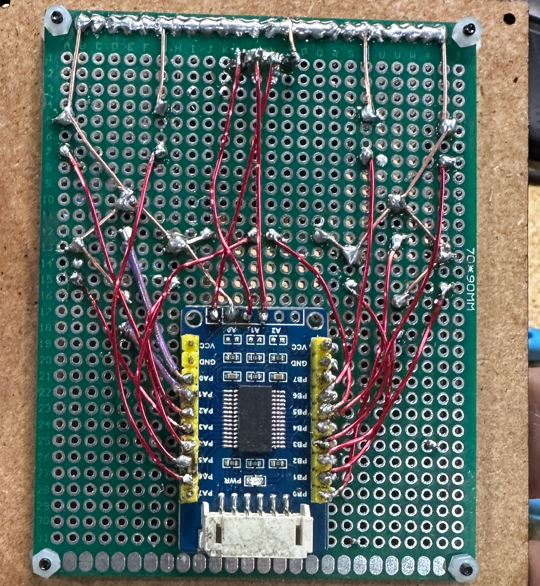
</div>

---

### **<u>A19. Connect button signals</u>**

Next, connect the other leg of each button to the appropriate MCP23017 GPIO pins according to this guide (referencing the full circuit schematic may help here):

<div style="overflow-x: auto;">

|Button       |Connect to|
|-------------|----------|
|Button North |A0        |
|Button South |A1        |
|Button West  |A2        |
|Button East  |A3        |
|Button R     |A4        |
|Button Start |A5        |
|Button Home  |A6        |
|Button UP    |B0        |
|Button Down  |B1        |
|Button Left  |B2        |
|Button Right |B3        |
|Button L     |B4        |
|Button Select|B5        |
|Button Share |B6        |

</div>

<div align="center">

</div>

That's it for that step; the hard part is over!

---

## 5: Build the Drum

<div align="right"><sub><a href="#table-of-contents">↑ Back to Top</a></sub></div>


**Important:** The SVG files are provided at the correct scale and should NOT be resized. The drum dimensions are precisely calculated to work with the sensor housings and other non-scalable components.

To verify the SVG files are at the correct scale before cutting, check that the 14 mounting holes in the drum base measure exactly 6mm in diameter.

**No CNC access?** Ask a friend, local shop, or check if your area has a Makerspace. Alternatively, print the SVG files full-size across multiple sheets (ensure your printer is set to 100% scale / "Actual Size"), overlay the paper on your wood as a template, and cut and drill by hand.

### B: Prepare the Wood

### **<u>B1. Cut all MDF wood pieces per SVG templates</u>**

💾 [File packet located here](https://ouchitaikoproject.github.io/OuchiTaikoProject/DownloadFiles/KillerQsOuchiTaikoProjectSTLandSVGFiles.zip)

You can also cut all of the pieces using a handsaw, jigsaw, etc. if a CNC machine or Laser cutter isn't available. You can check with your local Makerspace for assistance as well.

---

### **<u>B2. Sand smooth as needed</u>**

---

### Assemble the Drum Structure

<div align="right"><sub><a href="#table-of-contents">↑ Back to Top</a></sub></div>

### **<u>B3. Glue rear base plates</u>**

Use Wood Glue to glue the two identical rear base plates together (they are 100% identical, just align the holes). Clamp securely or weigh down and let dry for several hours.

<div align="center">
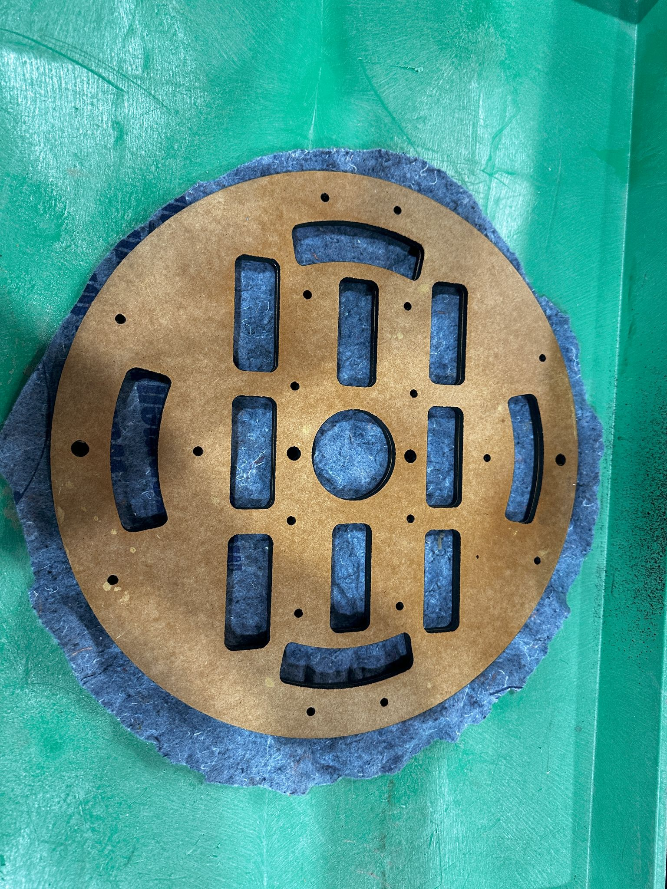
</div>

---

### **<u>B4. Glue drum panels</u>**

Use Wood Glue to glue a Don/Ka top/bottom panel pair together (solid face piece on top + piece with pre-cut holes on bottom). Clamp securely or weigh down and let dry for several hours. Repeat this for the remaining three drum panels.

*Note: Ignore the 4 smaller holes in the center, your version will be different and only have 2 holes - this is an example from an earlier version.*

<div align="center">
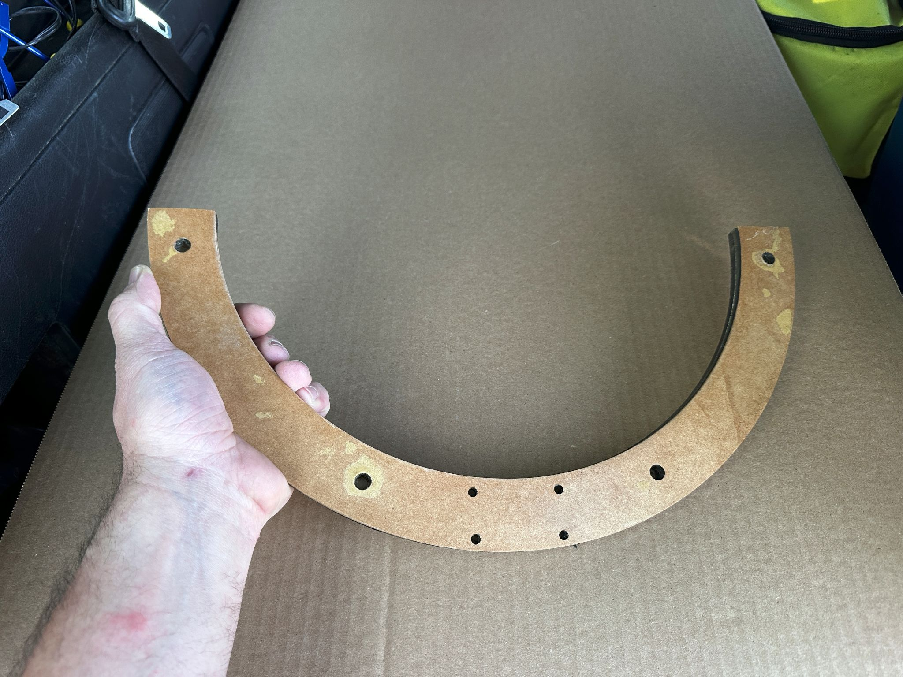
</div>

---

### **<u>B5. Router/sand Ka rim edges</u>**

Use a router or at least sand down the sharp outer, curved edge of the Ka rim faces. This helps prevent stick damage. Do not smooth/route the inside edges at all, just the outside curve.

<div align="center">
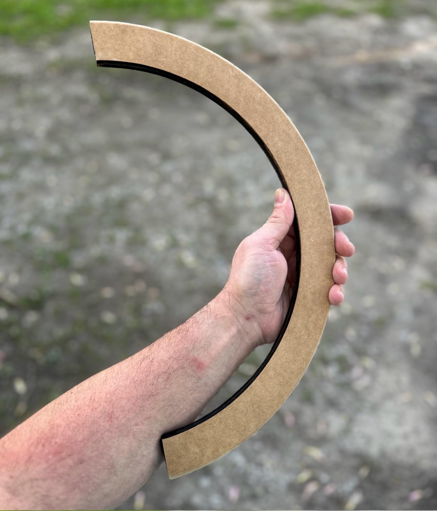
</div>

---

### **<u>B6. Drill holes for threaded inserts</u>**

Using an 8mm diameter drill bit (or the specialized drill bit that came with your threaded wood inserts), locate the 14 pre-cut 6mm holes where the rubber grommets will go, and use those holes as guides to drill - you'll drill into those 6mm holes and turn them into new 8mm wide x 11mm deep holes. Mark your drill bit at the 11mm mark with tape for easy reference so you know when to stop.

<div align="center">
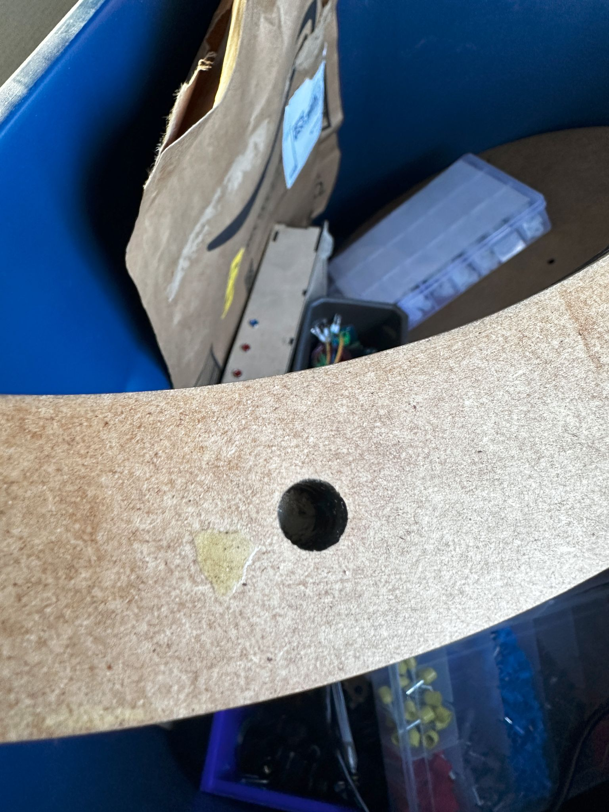
</div>

---

### **<u>B7. Chamfer holes</u>**

Chamfer the rim of the 8mm hole slightly so that the threaded inserts will tighten down flush and feel smooth when your fingers pass over them. This can be done with a sharp screwdriver, knife, etc.

<div align="center">
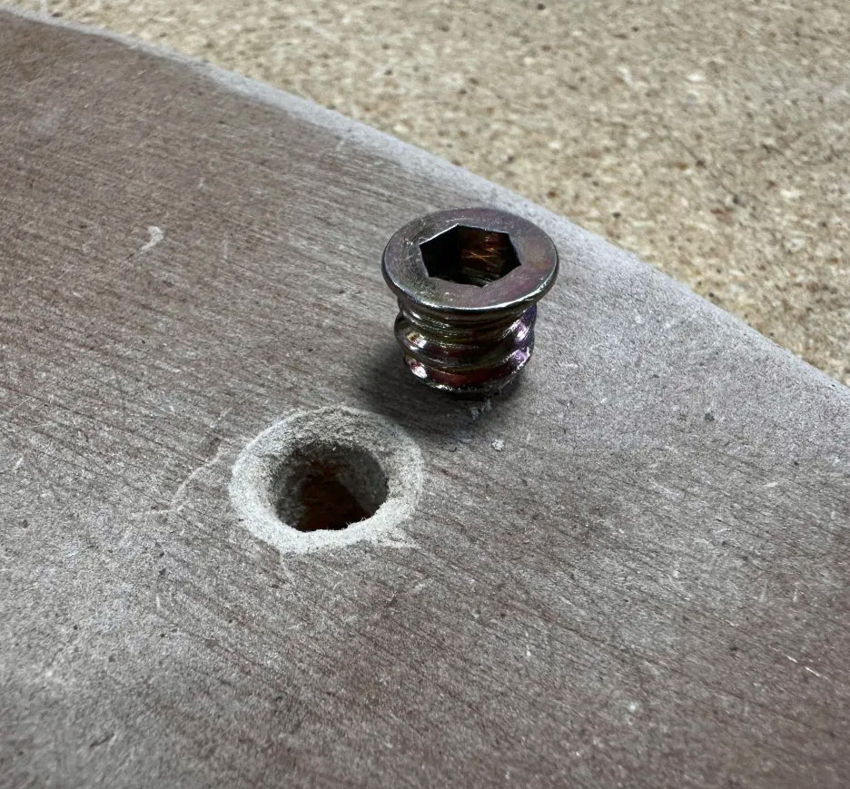
</div>

<div align="right"><sub><a href="#table-of-contents">↑ Back to Top</a></sub></div>

---

### **<u>B8. Install M6 threaded inserts</u>**

Screw in the 14 individual M6 threaded wood inserts into the appropriate holes until flush (add Superglue to the *outside* of threads to help secure them to wood).

<div align="center">
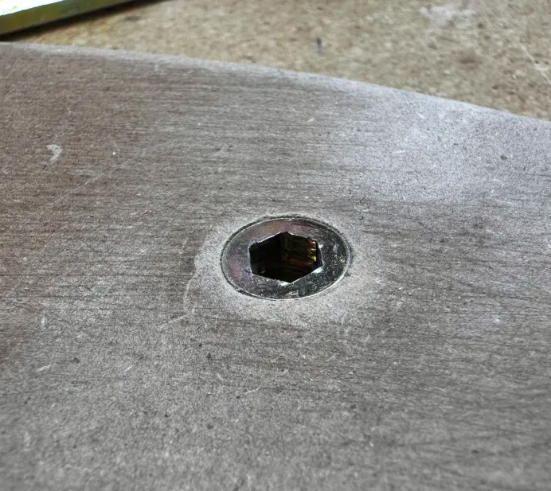
</div>
<div align="center">
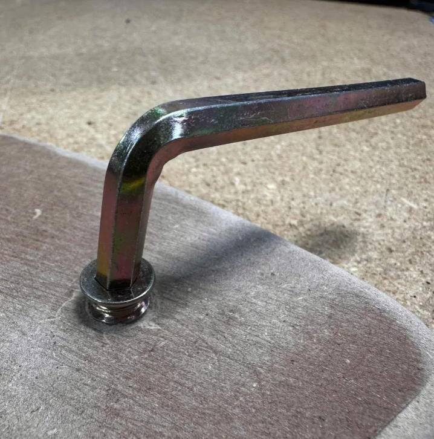
</div>

---

### **<u>B9. Install M3 threaded inserts</u>**

Tap in the 8 individual M3 threaded inserts (2 in each bottom panel) flush to the wood with a mallet (add Superglue to *outside* of threads to help secure to wood) - this is where the sensor housings will mount later on.

*Note: Your orientation will be different, this is just an example from an earlier version.*

<div align="center">
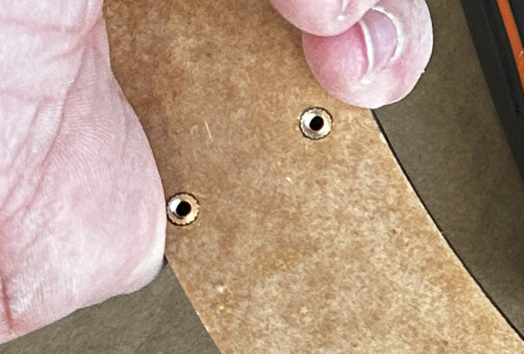
</div>

---

### C: Install Rubber Isolators

<div align="right"><sub><a href="#table-of-contents">↑ Back to Top</a></sub></div>

### **<u>C1. Cut nylon bolt head</u>**

Cut the head off of a 20mm M6 nylon bolt.

<div align="center">
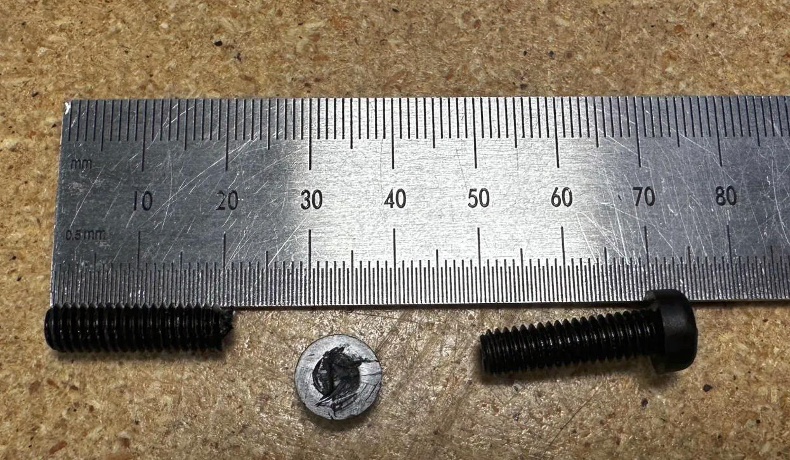
</div>

---

### **<u>C2. Apply Loctite to isolator</u>**

Apply one drop or less of Loctite to threads on the inside of the rubber isolator threaded hole.

---

### **<u>C3. Install bolt in isolator</u>**

Screw the headless bolt into isolator until it stops.

<div align="center">
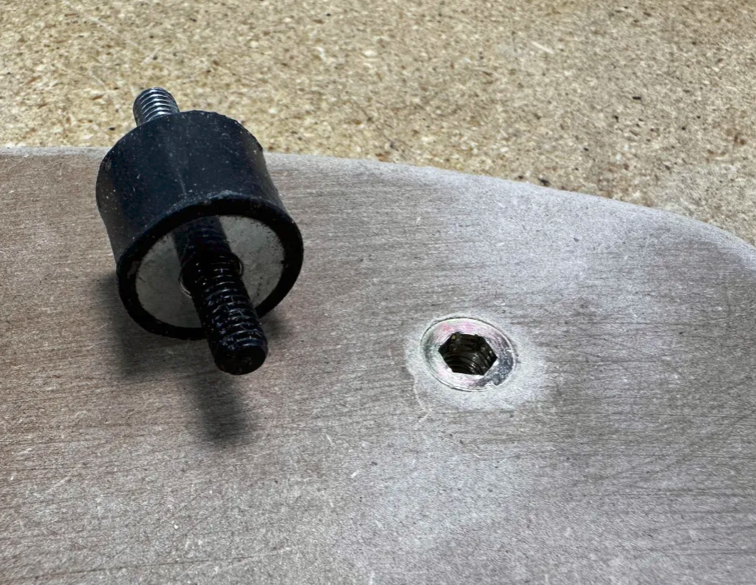
</div>
<div align="center">

</div>

---

### **<u>C4. Apply Loctite to drum plate inserts</u>**

Add one drop or less of Loctite to inside threads of the M6 threaded inserts on the bottom face of the drum plates.

---

### **<u>C5. Install isolator assemblies</u>**

Screw the nylon bolt of the rubber grommet assembly into the threaded insert in the bottom of the drum faces - finger-tighten until flush.

Repeat C1-C5 for the remaining 13 similar holes.

This metal bolt will go through the matching holes in the drum baseplate in a later step.

<div align="center">
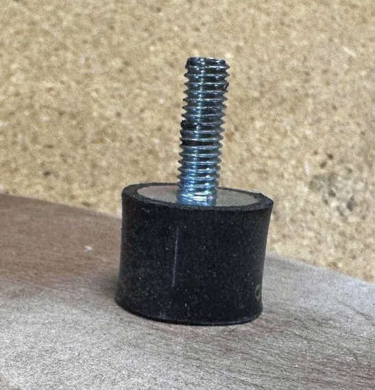
</div>

**Note:** You will be directed to complete the rest of drum assembly after sensors are installed (end of Section E below).

---

### D: Print Housings

<div align="right"><sub><a href="#table-of-contents">↑ Back to Top</a></sub></div>

### **<u>D1. Print 4 sets of complete sensor housings</u>**

💾 [Files are in the file packet here](https://ouchitaikoproject.github.io/OuchiTaikoProject/DownloadFiles/KillerQsOuchiTaikoProjectSTLandSVGFiles.zip)

Use PLA filament.

Settings: 0.2mm layer height, 40% Gyroid infill, no supports needed.

---

### E: Assemble Sensors

<div align="right"><sub><a href="#table-of-contents">↑ Back to Top</a></sub></div>

🎥 [Video overview of sensor housing assembly](https://youtu.be/tQe-xDEqEdY)

**Note:** The below steps will need to be repeated 4 times - you will have a total of 4 complete sensor dongles.

### **<u>E1. Cut neoprene discs</u>**

Cut four 12mm neoprene discs per SVG template.

💾 [Template found in the file packet here](https://ouchitaikoproject.github.io/OuchiTaikoProject/DownloadFiles/KillerQsOuchiTaikoProjectSTLandSVGFiles.zip)

---

### **<u>E2. Glue neoprene to housing</u>**

Superglue neoprene disc into the printed housing's bottom center, aligned with the raised ring guide. Press for 30 seconds.

<div align="center">
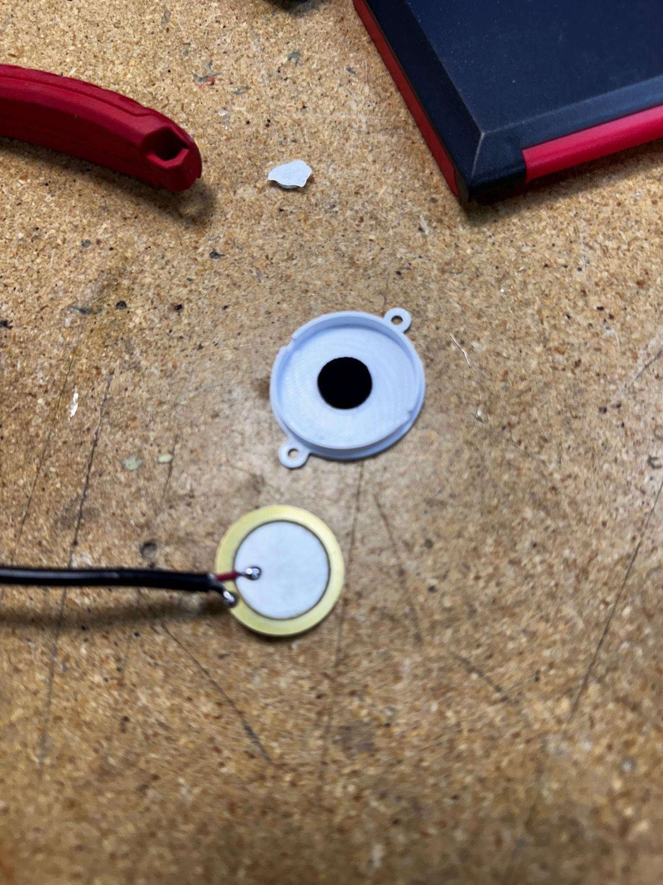
</div>

---

### **<u>E3. Strip Siamese wire</u>**

Take 10" length of Siamese wire, strip both ends exposing the two wires within.

---

### **<u>E4. Solder to TRS jack</u>**

Take one end of the wire and solder the two exposed wires to the male TRS jack:

- Red connects to the TIP
- Black connects to the SLEEVE

<div align="center">

</div>

<div align="right"><sub><a href="#table-of-contents">↑ Back to Top</a></sub></div>

---

### **<u>E5. Solder to piezo</u>**

Take the *other* end of the stripped wire, solder red wire to piezo center disc (**near outer edge of center**), and solder black wire to outer brass ring.

<div align="center">
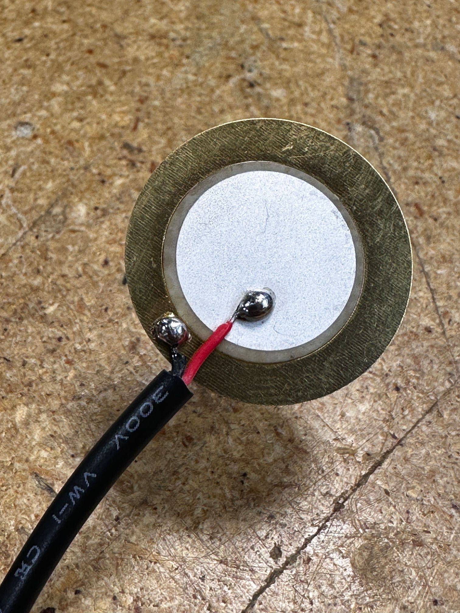
</div>

---

### **<u>E6. Glue piezo to neoprene</u>**

Add several drops of Superglue on the surface of neoprene (created in step E2). Center the piezo sensor face up (all-brass side faces *down*) on the neoprene and press together. Hold for 30 seconds. Be sure that wire is laying across the strain relief channel and in the hole cutout.

*Note: Pic varies slightly from your version - this was an earlier version. You will have a more pronounced strain relief channel.*

<div align="center">

</div>

---

### **<u>E7. Assemble housing</u>**

Add a drop of Superglue to the strain relief channel (below wire as well as on topside) and add a few drops to the upper housing around the rim sides, then attach the top and bottom housing pieces, press and hold for 30 seconds.

<div align="center">
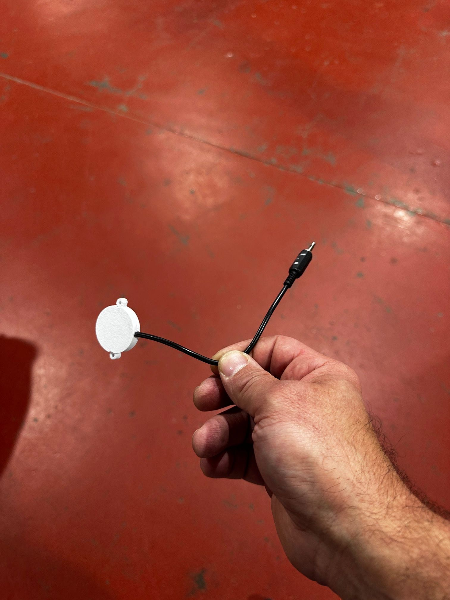
</div>

---

### **<u>E8. Mount housings to drum</u>**

Mount completed housings to the underside of drum faces using 2 M3x8mm screws for each housing and screw them into the threaded inserts that you added in the earlier step. (Be sure that the bottom (side with the neoprene disc inside) of the housing is against the wood).

Tighten snug for even, firm contact with the wood - but don't over-tighten.

Here's a photo of one housing right before it's screwed into the threaded insert:

<div align="center">
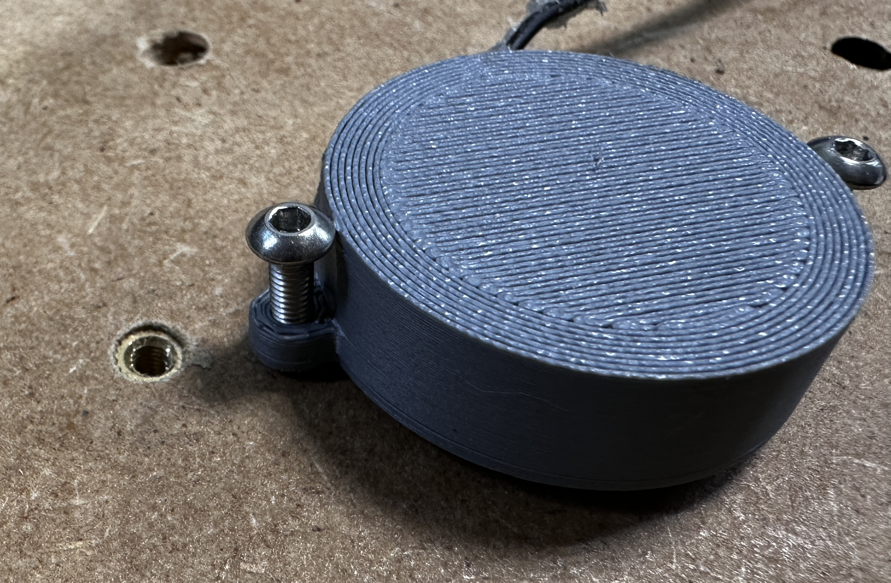
</div>

---

### F: Mounting Hardware Assembly

<div align="right"><sub><a href="#table-of-contents">↑ Back to Top</a></sub></div>

### **<u>F1. Mark mounting holes</u>**

Place your speaker bracket against the backside of your rear base plates so that it is centered and not blocking any other holes. Mark the 4 holes that you will use to mount it with.

<div align="center">
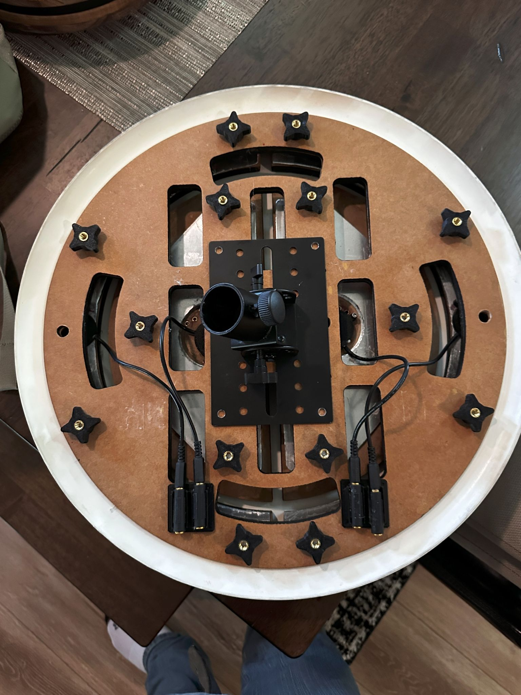
</div>

---

### **<u>F2. Drill mounting holes</u>**

Remove the speaker plate and drill your 4 marked holes using a 6mm drill bit.

<div align="center">
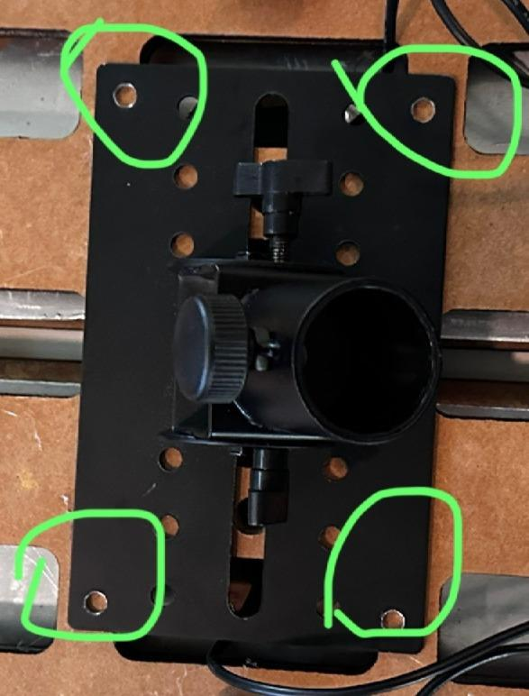
</div>

---

### **<u>F3. Install mounting bolts</u>**

Feed 4x M6x16 bolts with washers through these mounting holes on baseplate so that they protrude from the rear to attach the speaker mounting plate.

<div align="center">

</div>

---

### **F4.** Attach speaker mount

Attach adjustable speaker mount to the speaker bracket, secure with M6 knobs.

<div align="center">
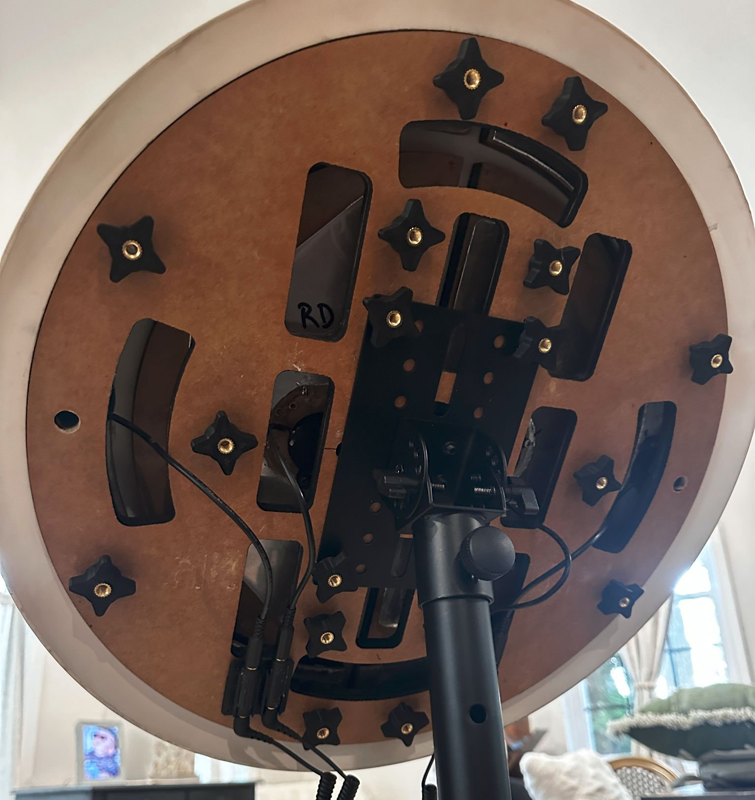
</div>

<div align="right"><sub><a href="#table-of-contents">↑ Back to Top</a></sub></div>

---

### **F5.** Assemble drum structure

Now assemble the rest of the drum structure by feeding the M6x18 bolts on the bottom of the 4 drum faces through base plate holes of the rear baseplate.

<div align="center">
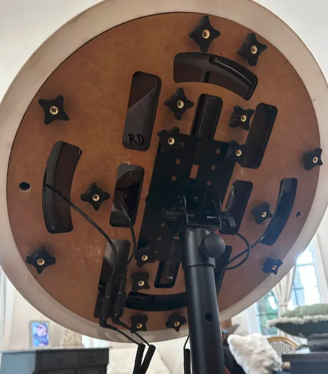
</div>

---

### **F6.** Route sensor wires

Route sensor wires through nearest openings.

<div align="center">

</div>

---

### **F7.** Secure drum faces

Secure the drum faces with the M6 knobs on exposed bolts.

<div align="center">

</div>

---

### **F8.** Attach TRS barrel mounts

3D Print and Attach TRS barrel mounts with adhesive tape as seen in pictures.

*Note: You will not have connected the barrel connectors yet, photo for placement reference.*

<div align="center">
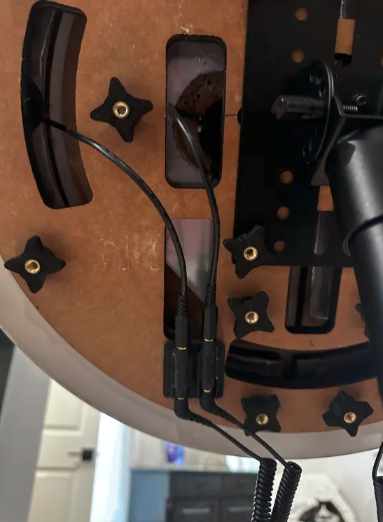
</div>

---

### **F9.** Connect sensor cables

Connect 3.5mm TRS male drum sensor ends to top of barrel couplers.

<div align="center">

</div>

---

## 6: Control Box

<div align="right"><sub><a href="#table-of-contents">↑ Back to Top</a></sub></div>


You're almost there!

The USB hub and USB DAC steps below are required for the build, but the structural enclosure itself is optional.

That said, some type of control box enclosure is highly recommended to protect your circuit and components. It keeps parts clean and safe, and allows you to connect and disconnect the drum without exposing the electronics.

### Enclosure Options

- **Custom wood box:** Visit [Boxes.py](https://boxes.hackerspace-bamberg.de/) to design and create your own
- **Simple alternatives:** Cardboard box or small plastic storage container work fine

I chose to not provide specific plans for the control box since everyone's layout will vary slightly depending on their build choices and creative freedom. The steps below show my personal approach that you can adapt your own version.

---

### G: Connect Sensors To The Circuit

### **G1.** Connect sensor cables to circuit

Using short male-to-male 3.5mm TRS cables, connect the bottom of the 4 couplers from the last step to the input of the Female TRS jacks on your completed circuit.

This completes the core circuit assembly.

The next step will incorporate a few last steps to make the connections more user-friendly, as well as keep your circuit protected in an enclosure.

---

### Final Connections and Housing

<div align="right"><sub><a href="#table-of-contents">↑ Back to Top</a></sub></div>

### **G2.** Mount TRS jacks to control box

Mount the 4 Female TRS jacks that are part of your circuit to the wall of your control box so that they face the outside.

<div align="center">
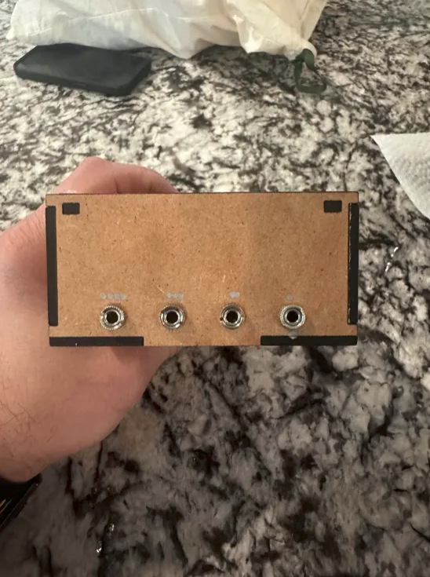
</div>

<div align="center">
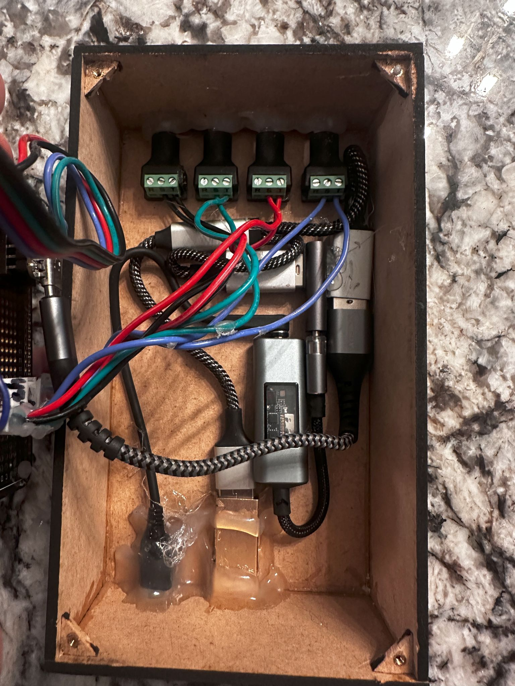
</div>

---

### **G3.** Mount USB-C to USB-A adapter

Connect the USB C to USB A adapter in the wall of your box so that the USB C portion is facing the outside of the box. Use hot glue to affix in place.

<div align="center">

</div>

<div align="center">
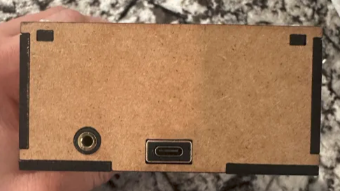
</div>

---

### **G4.** Connect USB hub

Connect the USB HUB to the USB A side of the adapter you just glued into place.

<div align="center">
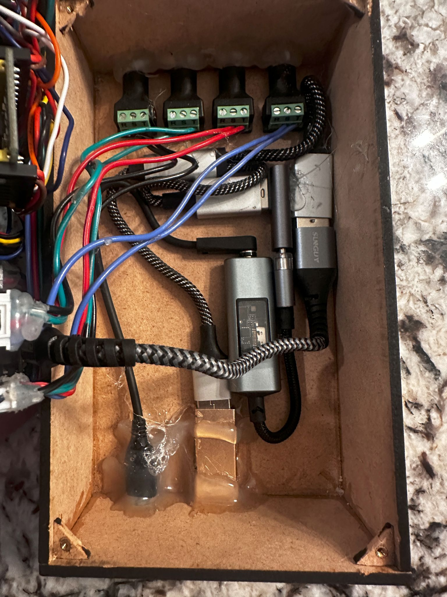
</div>

---

### **G5.** Connect XIAO to USB hub

Connect the XIAO main controller board to the USB Hub using a short USB C to USB A cable.

---

### **G6.** Connect USB DAC

Connect your USB DAC to the USB Hub.

---

### **G7.** Connect DAC to extension cable

Connect the 3.5mm audio out jack on your USB DAC to the short 3.5mm TRS extension cable.

<div align="right"><sub><a href="#table-of-contents">↑ Back to Top</a></sub></div>

---

### **G8.** Mount audio jack to control box

Connect the 3.5mm Female end of the short audio extension cable you just connected to the wall of your controller box so that it faces outside of the box. Use hot glue to affix in place.

<div align="center">

</div>

<div align="center">

</div>

---

### **G9.** Mount OLED/button board

Mount the board with your OLED screen and gamepad buttons so that the screen is visible and the buttons are accessible during gameplay.

<div align="center">
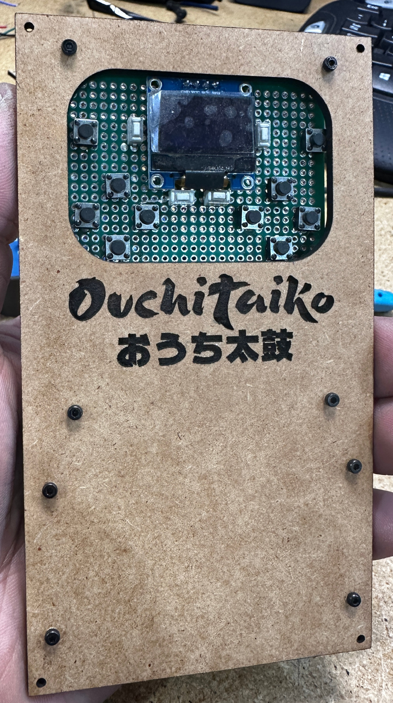
</div>

---

### **G10.** Wire management

Here's an example of how the inside of your control box may look.

Take your time with wire management. It doesn't have to be the prettiest thing in the world but make sure of the following:

- All connections are secure, and nothing will be bent or stressed or pulled loose when the box is closed
- As much as possible, route your VCC power lines and ground lines away from signal wires and button wires

<div align="center">
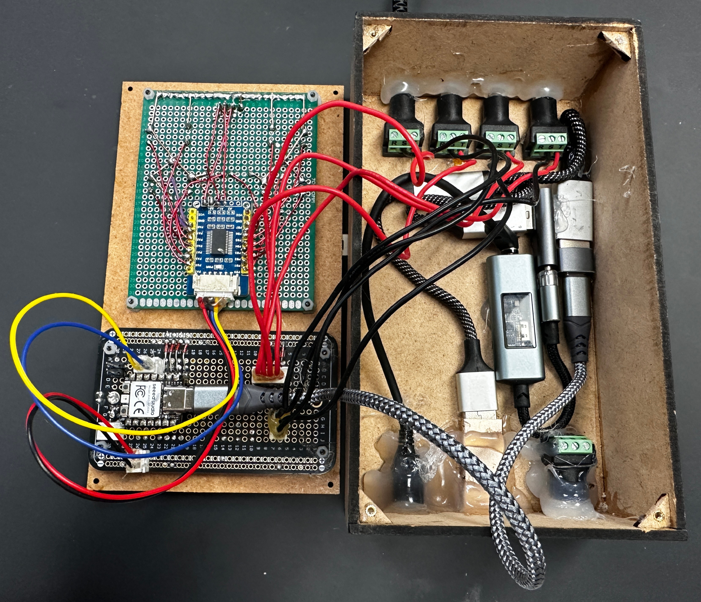
</div>

---

### H: Floor Stand

<div align="right"><sub><a href="#table-of-contents">↑ Back to Top</a></sub></div>

### **H1.** Mount bracket to speaker stand

Mount bracket to the speaker stand.

<div align="center">

</div>

---

### **H2.** Adjust height/angle

Adjust height/angle for playing comfort.

---

### **H3.** Add drum cover

Add your Drum cover, skin, towel, padding, or whichever you have. As my dimensions for the drum in this project are exactly the same as the Arcade Drum, I recommend locating an official Arcade drum skin. One source that seems to always have them in stock is [here](https://taiko.ac/products/rubber-drum-pad).

If that isn't an option for you, you can try using a towel, blanket, large mouse pad, thin foam, whatever you want that gives you sound-reducing qualities as well as the amount of bounce that you're looking for.

The beauty of my Project is that you can adjust the Drum and make it perform just how you want regardless of Drum cover.

<div align="center">
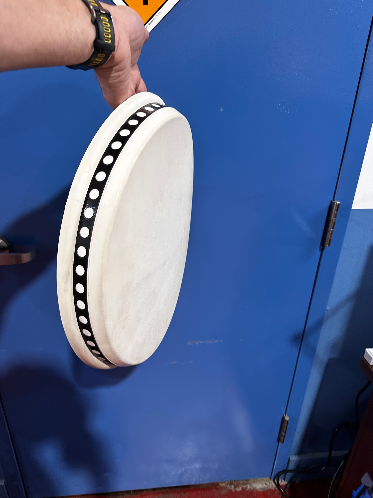
</div>

---

## 7: Flash The Firmware

<div align="right"><sub><a href="#table-of-contents">↑ Back to Top</a></sub></div>


Great job making it this far! Now it's time to prepare the board and flash the firmware. This is the quickest and easiest part of the entire build.

💾 [Download the two flash files in the .zip archive](https://ouchitaikoproject.github.io/OuchiTaikoProject/DownloadFiles/KillerQsOuchiTaikoProjectFlashFiles.zip)

### Step 1: Enter Boot Mode

Hold down the small "B" button on your actual XIAO RP2040 micro controller board while connecting it to your PC. The board will appear as a removable drive.

### Step 2: Wipe the Board

Drag `universal_flash_nuke.uf2` to the root of the removable drive. This wipes the board for a fresh start and automatically reboots it. The drive will reappear, ready for the next step. Repeat this step one more time for good measure.

### Step 3: Flash the Firmware

Drag `KillerQsOuchiTaikoFirmware.uf2` to the removable drive. After a few seconds, the board will upload the file and automatically reboot. This time, the drive won't reappear—that's correct! Your board is now in controller mode and ready to play.

You're ready for calibration and testing!

---

## 8: Calibration & Setup

<div align="right"><sub><a href="#table-of-contents">↑ Back to Top</a></sub></div>


### Complete this initial calibration before proceeding further

Long-press SELECT to enter setup mode. Set controller emulation to SWITCH TATACON mode (default). Tap all four drum sensors and press all 14 navigation buttons at the [Meloncolle Taiko Controller website](https://meloncolle.com/tatacon). You're just ensuring that they register at all, and in the correct location. If automatic drum hits occur without touching anything, don't worry—this is normal during initial setup, and the calibration process below will fix it.

### Basic Drum Hit Calibration

#### Step 1: Enter the Drum Settings

- Hold SELECT for 1 second to open the Main Menu
- Scroll to Drum Settings → press B / Circle to open

#### Step 2: Adjust Drum Thresholds

Each pad (Left Ka, Left Don, Right Don, Right Ka) has its own threshold value — how hard you must hit before it registers.

- If light hits don't register, lower the threshold
- If false hits happen too easily, raise the threshold
- If you find that hitting one drum causes ANOTHER drum to trigger, raise the threshold value of the drum that accidentally triggered by a one or two steps. Repeat this until all drums function normally. This should only need to be done once during the initial setup with your particular drum

---

### Extended Drum Setting Features

<div align="right"><sub><a href="#table-of-contents">↑ Back to Top</a></sub></div>

#### Big Hit Arcade Mode

This controls how the drum reacts to very strong strikes. By default, home versions of the Taiko games give full points for Big Notes by simply hitting both Don or Ka at the same time. My Big Hit Arcade Mode allows for that "Arcade Hit" where you have to hit the Don or Ka *harder* to get credit for the Big Notes — just like the Official Taiko Arcade Machines operate.

- Set Detection: ON
- Adjust Threshold Level: Start around 850
- Increase the value to lower the threshold of what counts as a Big Hit
- Decrease the value to make it so that you have to hit much harder for the Big Note to register

#### SimulTap Mode

By Default, the firmware makes it so that you cannot hit a Don and Ka at exactly the same time (since that situation doesn't exist in gameplay — this simply helps ensure clean hits).

- Turn SimulTap ON if you want combined left + right hits to register as a single action
- Leave it OFF for standard play or if you notice misreads

#### Hold Time

This defines how long a hit is "held" before the drum accepts another.

- Recommended range: 25—35ms
- Increase if double hits register too fast
- Decrease if hits feel laggy or delayed
- In most cases, this is not needed — some say it helps when playing on the Nintendo Switch

---

### Display Tips While Playing

<div align="right"><sub><a href="#table-of-contents">↑ Back to Top</a></sub></div>

- Streak counter resets after 1 second of inactivity
- Main Screen Character animations confirm every registered hit
- Each character represents its drum position (left to right)
- Consistent missed hits on one pad? Check that pad's threshold

### Pro Tips

- Different drum covers may need threshold adjustment
- Big Hit threshold is typically 2-3x normal threshold
- Use Debug mode to see raw ADC values (should be 200-400 baseline)

You've just built a professional controller circuit with adaptive baseline technology that automatically maintains perfect calibration—no manual adjustments needed as components wear or age!

**You're Ready to Play!**

---

## 9: Files & Downloads

<div align="right"><sub><a href="#table-of-contents">↑ Back to Top</a></sub></div>


<div align="center">

</div>

💾 Here are the files referenced throughout the guide for quick reference:

- [Download all SVG and STL Files](https://ouchitaikoproject.github.io/OuchiTaikoProject/DownloadFiles/KillerQsOuchiTaikoProjectSTLandSVGFiles.zip)
- [Download PDF file of the Circuit Schematic](https://ouchitaikoproject.github.io/OuchiTaikoProject/DownloadFiles/KillerQsOuchiTaikoProjectCircuitSchematic.pdf)
- [Download the Firmware File + Nuke File](https://ouchitaikoproject.github.io/OuchiTaikoProject/DownloadFiles/KillerQsOuchiTaikoProjectFlashFiles.zip)
- To Download a copy of this guide, use the download link on the landing page at [www.OuchiTaiko.com](http://www.OuchiTaiko.com) or simply save the PDF using your Web Browser's preferred method

---

## 10: Basic Troubleshooting

<div align="right"><sub><a href="#table-of-contents">↑ Back to Top</a></sub></div>


<summary><b>🖥️ DISPLAY Issues</b></summary>

- **Blank OLED:** Check I2C (GPIO 6/7), verify 3.3V power
- **Frozen:** Unplug USB cable and reconnect
- **Menu won't open:** Hold SELECT for full 1 second
- **No animation:** Check if sensors register (LED flash)

</details>


<summary><b>🥁 SENSOR Issues</b></summary>

- **No response:** Check diode polarity, TRS wiring
- **False triggers:** Increase thresholds
- **Missed hits:** Decrease thresholds, check mounting
- **Crosstalk:** Increase threshold on triggering pad

</details>


<summary><b>🎮 MODE SWITCHING Issues</b></summary>

- **Freezes:** Unplug/reconnect USB-C
- **No change:** Press EAST to confirm

</details>


<summary><b>🔊 AUDIO Issues</b></summary>

- **No sound:** Check USB DAC, verify audio output device
- **Crackling:** Try different USB port
- **Latency:** Should be <5ms, check game/computer settings

</details>

If you have trouble with a particular game version, note your current emulation mode and research what others have done to get that controller series working with your game version.

---

## 11: About

<div align="right"><sub><a href="#table-of-contents">↑ Back to Top</a></sub></div>


This project is a one-of-a-kind Hybrid product that pulls from several amazing resources. As they say, "We stand on the shoulders of Giants…"

The core firmware as well the navigation and OSD hardware portion of the Circuit was adapted from the amazing work by 'ravinrabbid' who created the **[DonCon 2040](https://github.com/ravinrabbid/DonCon2040)** Project. You can visit there for more of the nitty-gritty details of the software.

The inspiration for the circuit came from the great, amazingly straightforward circuitry work by 'kasasiki3' who created the **[HIDtaiko](https://github.com/kasasiki3/HIDtaiko/tree/master)** Project (2040 edition).

Without these two projects, none of this would have been possible.

Credit to 'Gadgetoid' on GitHub for his [pico-universal-flash-nuke](https://github.com/Gadgetoid/pico-universal-flash-nuke) file that helps clean things up between flashes.

Credit to the creative minds over at [Boxes.py](https://boxes.hackerspace-bamberg.de/) as well for creating the ultimate box-creating resource. It offers endless ideas and guides on how to make enclosure boxes for pretty much anything - especially projects like this.

I want to thank Discord user 'Allspice.' I discovered a random message from him in my inbox one day asking if he could help test my Taiko Project when I was finished creating it. He said he had only basic soldering skills, yet he was able to successfully build the entire circuit from scratch as well as the drum! Even more importantly, he helped shape this how-to guide that you are reading right now.

I also want to take a moment to mention a few resources that were invaluable for me during this entire process. These are great if you ever want to go down the rabbit hole of the world of Taiko no Tatsujin modding or Custom Controller creation - with these assets, you have the power to create anything imaginable:

- [Taiko no Tatsujin Modding! Discord Channel](https://discord.com/invite/HFm37aA5zr)
- [Cons&Stuff :) Discord Channel](https://discord.com/invite/P4CpVHrR?utm_source=Discord%20Widget&utm_medium=Connect)
- [OpenStick Community - GP2040-ce Project Discord Channel](https://discord.com/invite/openstickcommunity-1049366310389289001)

(If you have any questions, please use the Discussion panel on my GitHub. You can also ask common, non-project-specific questions in the appropriate section of any of the forums mentioned above and tag me if needed.)

### Spread The Word

Please share your results and excitement as well as this guide with your favorite DIY gaming communities. Tag me (KillerQ97) when you do!

Enjoy, Have Fun, and Peace Out!

---

## 12: Copyright Information

<div align="right"><sub><a href="#table-of-contents">↑ Back to Top</a></sub></div>


### Copyright & License Transparency

As mentioned above, this project builds upon the outstanding work of the open-source community and strictly adheres to all licensing requirements. **OuchiTaiko** is primarily based on [ravinrabbid's DonCon2040](https://github.com/ravinrabbid/DonCon2040), which is licensed under the **MIT License**, and also incorporates elements from [kasasiki3's HIDtaiko](https://github.com/kasasiki3/HIDtaiko), licensed under the **Apache License, Version 2.0**.

All custom features, modifications, and improvements documented in this project (including KillerQ's creation of Big Notes detection, SimulTap mode, PS4 always-on, adaptive baseline tracking, critical mode-switching fixes, animated display system, enhanced menu navigation, and any other custom creations or modifications to include code, physical circuitry, Drum, or Drum-related design features and components) are transparently documented and shared under the same open-source spirit. I believe in giving credit where credit is due and maintaining the collaborative nature of the maker community. If you build upon this work, please honor these licenses by including proper attribution and license notices in your derivative projects as well as mentioning and/or tagging me, 'KillerQ.'

---

### Attribution Chain

- **Original DonCon2040 firmware:** © ravinrabbid (MIT License)
- **HIDtaiko components:** © kasasiki3 (Apache License 2.0)
- **Custom modifications and features:** Created by, and documented in this repository by KillerQ (Dual-licensed under MIT and Apache 2.0)

---

### Legal Compliance Notice

Any distribution of this firmware (binary or source) must include:

1. A copy of the MIT License from DonCon2040
2. A copy of the Apache License 2.0 from HIDtaiko
3. Copyright notices from both original projects
4. Attribution to all contributors

The complete license texts are provided below for full transparency and legal compliance.

---

## Complete License Documentation

### 1. License for KillerQ's Original Contributions

The modifications and original code contributed to this repository by **KillerQ** are **dual-licensed** under the **MIT License** and the **Apache License, Version 2.0**.

**Copyright (c) 2025 KillerQ**

---

### 2. External Component: DonCon2040 Firmware

**Applies to portions of OuchiTaiko firmware derived from DonCon2040.**

**Original Author:** ravinrabbid  
**License:** MIT License  
**Copyright (c) 2021 ravinrabbid**

#### Full Text: MIT License

```
Permission is hereby granted, free of charge, to any person obtaining a copy
of this software and associated documentation files (the "Software"), to deal
in the Software without restriction, including without limitation the rights
to use, copy, modify, merge, publish, distribute, sublicense, and/or sell
copies of the Software, and to permit persons to whom the Software is
furnished to do so, subject to the following conditions:

The above copyright notice and this permission notice shall be included in all
copies or substantial portions of the Software.

THE SOFTWARE IS PROVIDED "AS IS", WITHOUT WARRANTY OF ANY KIND, EXPRESS OR
IMPLIED, INCLUDING BUT NOT LIMITED TO THE WARRANTIES OF MERCHANTABILITY,
FITNESS FOR A PARTICULAR PURPOSE AND NONINFRINGEMENT. IN NO EVENT SHALL THE
AUTHORS OR COPYRIGHT HOLDERS BE LIABLE FOR ANY CLAIM, DAMAGES OR OTHER
LIABILITY, WHETHER IN AN ACTION OF CONTRACT, TORT OR OTHERWISE, ARISING FROM,
OUT OF OR IN CONNECTION WITH THE SOFTWARE OR THE USE OR OTHER DEALINGS IN THE
SOFTWARE.
```

---

### 3. External Component: HIDtaiko Components

**Applies to HID components and related code derived from HIDtaiko.**

**Original Author:** kasasiki3  
**License:** Apache License, Version 2.0  
**Copyright 2022 kasasiki3**

#### Full Text: Apache License, Version 2.0

```
Apache License
Version 2.0, January 2004
http://www.apache.org/licenses/

TERMS AND CONDITIONS FOR USE, REPRODUCTION, AND DISTRIBUTION

1. Definitions.

   "License" shall mean the terms and conditions for use, reproduction,
   and distribution as defined by Sections 1 through 9 of this document.

   "Licensor" shall mean the copyright owner or entity authorized by
   the copyright owner that is granting the License.

   "Legal Entity" shall mean the union of the acting entity and all
   other entities that control, are controlled by, or are under common
   control with that entity. For the purposes of this definition,
   "control" means (i) the power, direct or indirect, to cause the
   direction or management of such entity, whether by contract or
   otherwise, or (ii) ownership of fifty percent (50%) or more of the
   outstanding shares, or (iii) beneficial ownership of such entity.

   "You" (or "Your") shall mean an individual or Legal Entity
   exercising permissions granted by this License.

   "Source" form shall mean the preferred form for making modifications,
   including but not limited to software source code, documentation
   source, and configuration files.

   "Object" form shall mean any form resulting from mechanical
   transformation or translation of a Source form, including but
   not limited to compiled object code, generated documentation,
   and conversions to other media types.

   "Work" shall mean the work of authorship, whether in Source or
   Object form, made available under the License, as indicated by a
   copyright notice that is attached to or included in the work (an
   example is provided in the Appendix below).

   "Derivative Works" shall mean any work, whether in Source or Object
   form, that is based on (or derived from) the Work and for which the
   editorial revisions, annotations, elaborations, or other modifications
   represent, as a whole, an original work of authorship. For the purposes
   of this License, Derivative Works shall not include works that remain
   separable from, or merely link (or bind by name) to the interfaces of,
   the Work and Derivative Works thereof.

   "Contribution" shall mean any work of authorship, including
   the original version of the Work and any modifications or additions
   to that Work or Derivative Works thereof, that is intentionally
   submitted to Licensor for inclusion in the Work by the copyright owner
   or by an individual or Legal Entity authorized to submit on behalf of
   the copyright owner. For the purposes of this definition, "submitted"
   means any form of electronic, verbal, or written communication sent
   to the Licensor or its representatives, including but not limited to
   communication on electronic mailing lists, source code control systems,
   and issue tracking systems that are managed by, or on behalf of, the
   Licensor for the purpose of discussing and improving the Work, but
   excluding communication that is conspicuously marked or otherwise
   designated in writing by the copyright owner as "Not a Contribution."

   "Contributor" shall mean Licensor and any individual or Legal Entity
   on behalf of whom a Contribution has been received by Licensor and
   subsequently incorporated within the Work.

2. Grant of Copyright License. Subject to the terms and conditions of
   this License, each Contributor hereby grants to You a perpetual,
   worldwide, non-exclusive, no-charge, royalty-free, irrevocable
   copyright license to reproduce, prepare Derivative Works of,
   publicly display, publicly perform, sublicense, and distribute the
   Work and such Derivative Works in Source or Object form.

3. Grant of Patent License. Subject to the terms and conditions of
   this License, each Contributor hereby grants to You a perpetual,
   worldwide, non-exclusive, no-charge, royalty-free, irrevocable
   (except as stated in this section) patent license to make, have made,
   use, offer to sell, sell, import, and otherwise transfer the Work,
   where such license applies only to those patent claims licensable
   by such Contributor that are necessarily infringed by their
   Contribution(s) alone or by combination of their Contribution(s)
   with the Work to which such Contribution(s) was submitted. If You
   institute patent litigation against any entity (including a
   cross-claim or counterclaim in a lawsuit) alleging that the Work
   or a Contribution incorporated within the Work constitutes direct
   or contributory patent infringement, then any patent licenses
   granted to You under this License for that Work shall terminate
   as of the date such litigation is filed.

4. Redistribution. You may reproduce and distribute copies of the
   Work or Derivative Works thereof in any medium, with or without
   modifications, and in Source or Object form, provided that You
   meet the following conditions:

   (a) You must give any other recipients of the Work or
       Derivative Works a copy of this License; and

   (b) You must cause any modified files to carry prominent notices
       stating that You changed the files; and

   (c) You must retain, in the Source form of any Derivative Works
       that You distribute, all copyright, patent, trademark, and
       attribution notices from the Source form of the Work,
       excluding those notices that do not pertain to any part of
       the Derivative Works; and

   (d) If the Work includes a "NOTICE" text file as part of its
       distribution, then any Derivative Works that You distribute must
       include a readable copy of the attribution notices contained
       within such NOTICE file, excluding those notices that do not
       pertain to any part of the Derivative Works, in at least one
       of the following places: within a NOTICE text file distributed
       as part of the Derivative Works; within the Source form or
       documentation, if provided along with the Derivative Works; or,
       within a display generated by the Derivative Works, if and
       wherever such third-party notices normally appear. The contents
       of the NOTICE file are for informational purposes only and
       do not modify the License. You may add Your own attribution
       notices within Derivative Works that You distribute, alongside
       or as an addendum to the NOTICE text from the Work, provided
       that such additional attribution notices cannot be construed
       as modifying the License.

   You may add Your own copyright statement to Your modifications and
   may provide additional or different license terms and conditions
   for use, reproduction, or distribution of Your modifications, or
   for any such Derivative Works as a whole, provided Your use,
   reproduction, and distribution of the Work otherwise complies with
   the conditions stated in this License.

5. Submission of Contributions. Unless You explicitly state otherwise,
   any Contribution intentionally submitted for inclusion in the Work
   by You to the Licensor shall be under the terms and conditions of
   this License, without any additional terms or conditions.
   Notwithstanding the above, nothing herein shall supersede or modify
   the terms of any separate license agreement you may have executed
   with Licensor regarding such Contributions.

6. Trademarks. This License does not grant permission to use the trade
   names, trademarks, service marks, or product names of the Licensor,
   except as required for reasonable and customary use in describing the
   origin of the Work and reproducing the content of the NOTICE file.

7. Disclaimer of Warranty. Unless required by applicable law or
   agreed to in writing, Licensor provides the Work (and each
   Contributor provides its Contributions) on an "AS IS" BASIS,
   WITHOUT WARRANTIES OR CONDITIONS OF ANY KIND, either express or
   implied, including, without limitation, any warranties or conditions
   of TITLE, NON-INFRINGEMENT, MERCHANTABILITY, or FITNESS FOR A
   PARTICULAR PURPOSE. You are solely responsible for determining the
   appropriateness of using or redistributing the Work and assume any
   risks associated with Your exercise of permissions under this License.

8. Limitation of Liability. In no event and under no legal theory,
   whether in tort (including negligence), contract, or otherwise,
   unless required by applicable law (such as deliberate and grossly
   negligent acts) or agreed to in writing, shall any Contributor be
   liable to You for damages, including any direct, indirect, special,
   incidental, or consequential damages of any character arising as a
   result of this License or out of the use or inability to use the
   Work (including but not limited to damages for loss of goodwill,
   work stoppage, computer failure or malfunction, or any and all
   other commercial damages or losses), even if such Contributor
   has been advised of the possibility of such damages.

9. Accepting Warranty or Additional Liability. While redistributing
   the Work or Derivative Works thereof, You may choose to offer,
   and charge a fee for, acceptance of support, warranty, indemnity,
   or other liability obligations and/or rights consistent with this
   License. However, in accepting such obligations, You may act only
   on Your own behalf and on Your sole responsibility, not on behalf
   of any other Contributor, and only if You agree to indemnify,
   defend, and hold each Contributor harmless for any liability
   incurred by, or claims asserted against, such Contributor by reason
   of your accepting any such warranty or additional liability.

END OF TERMS AND CONDITIONS

APPENDIX: How to apply the Apache License to your work.

      To apply the Apache License to your work, attach the following
      boilerplate notice, with the fields enclosed by brackets "[]"
      replaced with your own identifying information. (Don't include
      the brackets!) The text should be enclosed in the appropriate
      comment syntax for the file format. We also recommend that a
      file or class name and description of purpose be included on the
      same "printed page" as the copyright notice for easier
      identification within third-party archives.

   Copyright [2022] [kasasiki3]

   Licensed under the Apache License, Version 2.0 (the "License");
   you may not use this file except in compliance with the License.
   You may obtain a copy of the License at

       http://www.apache.org/licenses/LICENSE-2.0

   Unless required by applicable law or agreed to in writing, software
   distributed under the License is distributed on an "AS IS" BASIS,
   WITHOUT WARRANTIES OR CONDITIONS OF ANY KIND, either express or implied.
   See the License for the specific language governing permissions and
   limitations under the License.
```

---

### Summary

This project is fully transparent about its licensing and gives proper credit to all contributors. By including the complete license texts above, this README serves as the authoritative legal documentation for the OuchiTaiko Project.

Thank you to ravinrabbid and kasasiki3 for their incredible open-source contributions that made this project possible.

**KillerQ**

---

*OuchiTaiko Project | Smarter. Simpler. Better.*
