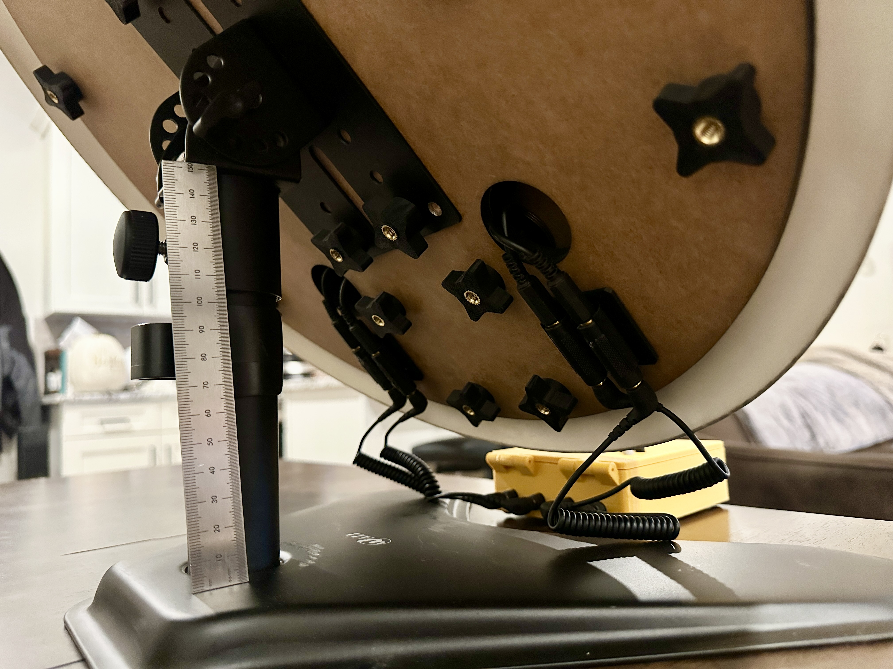
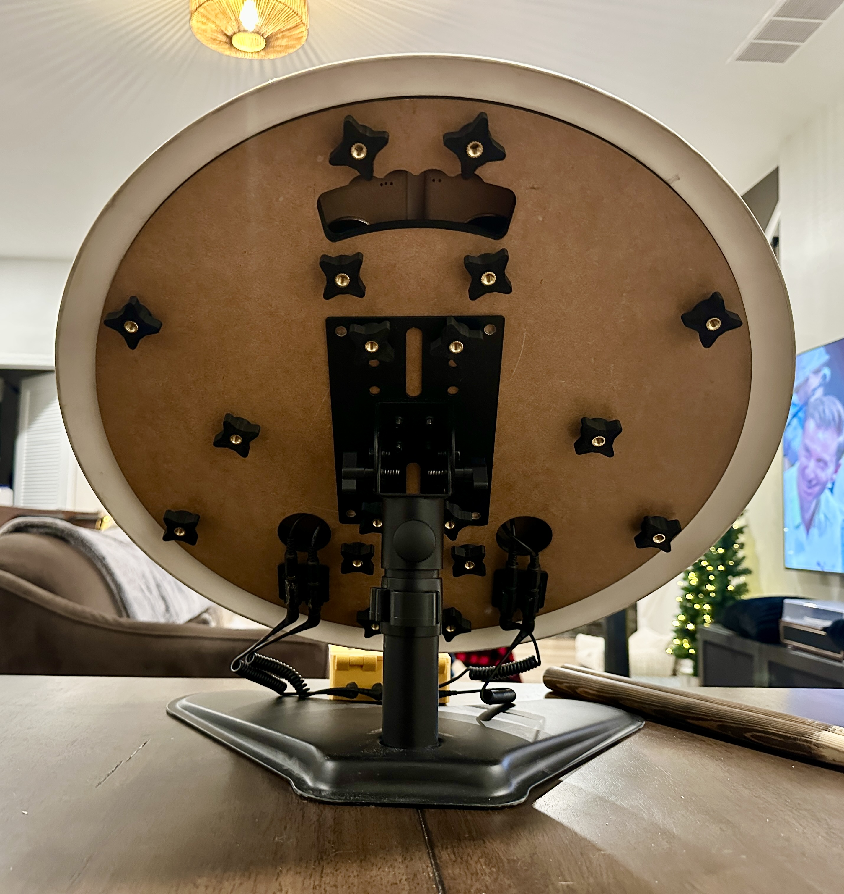

---

*In Japanese, 'ouchi' means 'home' and 'taiko' means 'drum.' Together, 'OuchiTaiko' represents the joy of bringing the authentic Taiko experience from the arcade into your own space.*

---

# **Table of Contents**
- [1: Project Overview / Unique Features](#1-project-overview)
- [2: Parts List for Electronics](#2-parts-list-for-electronics)
- [3: Parts List for Hardware](#3-parts-list-for-hardware)
- [4: Assemble the Control PCB](#4-assemble-the-control-pcb)
- [5: Build the Drum](#5-build-the-drum)
- [6: Control Box](#6-control-box)
- [7: Flash the Firmware](#7-flash-the-firmware)
- [8: Calibration & Settings](#8-calibration--settings)
- [9: Menu System Reference](#9-menu-system-reference)
- [10: About](#10-about)
- [11: Copyright Information](#11-copyright-information)

---

# **1: Project Overview**

#### The Finished Build:  
You'll be creating this entire drum and controller setup with your choice of <i>Floor-Standing Tripod...</i>

 
...Or <i>Table-Top mode...</i>
 
 

---

Hi, I'm KillerQ, the Creator of the **OuchiTaiko Project** - an open-source build guide for a professional arcade-grade Taiko drum controller unlike anything currently available.

This guide represents a full year of research and development, addressing the limited availability and high cost of commercial units. Using **Adaptive Baseline Software Intelligence (ABSI)**, this design achieves arcade-level performance through intelligent software paired with a purpose-built control PCB and a mechanically isolated sensor system.

All you need is basic soldering and woodworking skills. The components linked in this guide work together as tested, though compatible alternatives are welcome.

Don't be worried about the length of this guide - it was purposely created that way to guide the user through every single step of the process - leaving nothing to question.  Less thinking, more doing!

---

# **Key Features**

## **World-First Innovations** 

**The following three innovations were designed and created just for this project and, as of this writing, do not exist at all in any other Taiko Drum Controllers - DIY, or Professionally manufactured.  You're among the first to enjoy their benefits!**

**The Problem:** Traditional Taiko drum controllers require manual threshold adjustments through trial-and-error, often involving recompiling firmware or endless menu tweaking. Users struggle to find the perfect balance between sensitivity (missing hits) and false triggers (ghost hits from vibrations).

**The OuchiTaiko Solution is three-fold:**

1) Auto Calibration
2) Adaptive Baseline Analysis
3) Custom Sensor Housing

### **1) Auto Calibrate - Intelligent Threshold Detection**
The **Auto Calibrate** system intelligently analyzes your actual playing style and automatically calculates optimal sensitivity settings:

- **Eliminates manual tweaking** - no more trial-and-error  
- **Prevents false triggers** - intelligent 50-point safety margins  
- **Adapts to you** - learns your unique playing dynamics  
- **Future-proof** - recalibrate anytime conditions change

### **2) Adaptive Baseline Software Intelligence (ABSI)**

Achieves superior performance through elegant software:

- **Automatic sensitivity adjustment** based on environmental noise
- **Dynamic baseline tracking** adapts to temperature, humidity, and mounting changes
- **Zero calibration drift** over time

### **3) Custom Arcade Sensor Suspension**

Drum trigger sensors use **custom-designed suspension mounting** that improves upon the ones found in the actual Japanese Arcade machines.

Proper sensor suspension ensures:
- Consistent trigger response
- Elimination of mechanical crosstalk
- Accurate hit detection
- Long-term durability under heavy play

---

## **Complete Hardware & Features**

### **Standalone Testing & Display**

**No PC required** for setup, calibration, or troubleshooting:
- **OLED display** with real-time hit feedback and animated hit icons
- **Visual confirmation** of all 14 navigation buttons
- **Live stats:** Drum hit animations, controller mode, button press indicator, menu hints
- **Instant verification** that everything is wired correctly

Calibrate and test your entire system with just USB power--see exactly what's happening before you ever plug into a console or PC.

### **Professional Hardware**

- **Custom Sensor Housing and Optimized Software:** Enhanced mechanical and electronic false-trigger isolation
- **14 Game Navigation Buttons:** Full in-game navigation regardless of game version
- **Professional Mounting:** Optimal hardware stabilization via adjustable base and, angled drum face mount

### **14 Input Modes for Maximum Compatibility**

- Nintendo Switch Tatacon (HORI NSW-079 Taiko Drum)
- Nintendo Switch Pro Controller
- Sony PS3 Dualshock3 (PC/Steam only)
- Sony PS4 Tatacon Drum (HORI PS4-095 Taiko Drum) (PC/Steam only)
- Sony PS4 Dualshock4 (PC/Steam only)
- Keyboard Player 1
- Keyboard Player 2
- Microsoft Xbox Xbox360 (XInput)
- Android (XInput)
- iOS (XInput)
- Analog Player 1 (XInput)(Compatible with TaikoArcadeLoader)
- Analog Player 2 (XInput)(Compatible with TaikoArcadeLoader)
- MIDI Controller
- Web Calibrate

### **Zero Coding or Programming Required**

- **Drag-and-drop firmware** for instant setup
- **On-screen menus** for all settings and calibration
- **Automatic updates** without recompiling
- **No technical knowledge needed** - if you can follow instructions and use a soldering iron, you can build this

---

### Demo Videos

- [Gameplay](https://youtu.be/p4eFeo_LB5I?si=jDKb93B7uYx1qAux)

---

# **2: Parts List for Electronics**

<a href="#table-of-contents">-Back to Top-</a>

The current OuchiTaiko controller build is based around the **custom through-hole control PCB** for the **Waveshare RP2040-Zero**.

**Important:** "Quantity" refers to the number of individual items you need, not the number of retail packs.

| Item | Qty | Link |
| --- | --- | --- |
| Custom OuchiTaiko control PCB | 1 | Included in project files / order from current PCB gerbers |
| Waveshare RP2040-Zero | 1 | [Link](https://www.waveshare.com/rp2040-zero.htm) |
| 128x64 I2C OLED display | 1 | [Link](https://www.amazon.com/dp/B09T6SJBV5) |
| 6mm x 6mm tactile switches with caps | 14 | [Link](https://www.amazon.com/dp/B0827LX3FV) |
| 1N4148 diodes | 4 | [Link](https://www.amazon.com/dp/B0DN62QFYS) |
| `0.1uF` / `100nF` ceramic capacitors | 4 | [Link](https://www.amazon.com/dp/B08B3VCK42) |
| `1K` resistors | 4 | Standard through-hole `1K` resistor assortment or singles |
| 3.5mm TRS female jacks | 4 | [Link](https://www.amazon.com/dp/B017CBTLJK) |
| 3.5mm TRS male plugs | 4 | [Link](https://www.amazon.com/dp/B07Y8JGFS1) |
| 27mm piezo sensors | 4 | [Link](https://www.amazon.com/dp/B07RK2TQ8D) |
| 22 AWG wire | as needed | [Link](https://www.amazon.com/dp/B0CN76L8G3) |
| 4-conductor wire / ribbon cable | as needed | [Link](https://www.amazon.com/dp/B09X47XBFS) |
| USB-C cable | 1 | [Link](https://www.amazon.com/dp/B0CKXZML11) |
| Small OLED mounting hardware | 4 sets | Match your OLED board hole pattern |

---

# **3: Parts List for Hardware**

<a href="#table-of-contents">-Back to Top-</a>

## **Required Tools and Supplies**

This guide assumes you have access to the following:

1. Laser cutter or CNC machine (or other means to cut wood)
2. Soldering iron and solder
3. Wire strippers/cutters
4. Screwdrivers
5. Hot glue gun
6. Strong clamps
7. Drill
8. Router
9. Sandpaper
10. Utility knife
11. Rubber mallet

## **Hardware Parts List**

| Item | Qty | Link |
| --- | --- | --- |
| 1/4" (or 6mm) 2ft x 4ft plank of cabinet-grade MDF | 2 | [Home Depot](https://www.homedepot.com/p/1-4-in-x-2-ft-x-4-ft-Medium-Density-Fiberboard-1508104/202089069) |
| 1/4" x 1-1/2" OD stainless steel fender washers | 46 | [Link](https://www.amazon.com/dp/B0D8ZRL1CP) |
| Strong wood glue | 1 | [Link](https://www.amazon.com/dp/B0002YQ378) |
| M3 x 8mm bolts | 8 | [Link](https://www.amazon.com/dp/B07CMQ1SQH) |
| M3 x 5mm threaded inserts | 8 | [Link](https://www.amazon.com/dp/B0CLKCQ2SH) |
| M6 x 10mm wood threaded inserts | 14 | [Link](https://www.amazon.com/dp/B0CNLRFFH1) |
| M6 x 35mm nylon bolts | 14 | [Link](https://www.amazon.com/dp/B07L9ZS21T) |
| M6 threaded 20mm x 15mm rubber isolators (one side M6 female, other side with M6 x 18mm bolt) | 14 | [Link](https://www.amazon.com/dp/B0BKPHT6Y9) |
| 3D printer filament (PLA) | 1 | [Link](https://www.amazon.com/dp/B081S5N5PC) |
| Gel superglue | 1 | [Link](https://www.amazon.com/dp/B0006HUJCQ) |
| Loctite thread adhesive - medium | 1 | [Link](https://www.amazon.com/dp/B000FIXQXK) |
| 2.2mm thick scuba knit neoprene fabric (only 4" x 4" total needed) | 1 | [Link](https://www.amazon.com/dp/B0DK1B5LZ7) |
| Finger knobs with pass-through M6 threads | 18 | [Link](https://www.amazon.com/dp/B07RW9ZH4H) |
| Mini PA speaker tripod stand (optional, for floor-standing mode) | 1 | [Link](https://www.amazon.com/dp/B094N9YG72) |
| Desktop monitor stand (optional, for table-top mode) | 1 | [Link](https://www.amazon.com/dp/B072QDMRS8) |
| Adjustable angle speaker bracket | 1 | [Link](https://www.amazon.com/dp/B0DR8NCZP6) |
| Spring-loaded phone holder with gooseneck arm (optional) | 1 | [Link](https://www.amazon.com/dp/B0F32MLBZX) |
| Rubber Taiko drum cover (optional, but important for arcade feel) | 1 | [Link](https://taiko.ac/products/rubber-drum-pad) |
| 1/4" roundover router bit | 1 | [Link](https://www.amazon.com/dp/B0C5DVBNLS) |
| Clear spray glaze / lacquer | 1 | [Link](https://www.amazon.com/dp/B00D0293SA) |
| Deburring tool (optional) | 1 | [Link](https://www.amazon.com/dp/B07RM1D6WD) |

---

# **4: Assemble the Control PCB**

<a href="#table-of-contents">-Back to Top-</a>

The current build uses the **custom through-hole control PCB**.

Your job here is straightforward:

1. Solder the through-hole parts onto the custom PCB.
2. Mount the Waveshare RP2040-Zero.
3. Mount the OLED.
4. Install the 14 tact switches.
5. Wire the 4 drum input jacks.
6. Flash firmware and test.

## **Control PCB Overview**

The custom board combines the controller logic, display wiring, and drum input network into one PCB:

- **Waveshare RP2040-Zero** as the main controller
- **4 ADC drum lanes** for `Ka Left`, `Don Left`, `Don Right`, and `Ka Right`
- **4 lane filter/protection networks** using `1N4148 + 0.1uF + 1K`
- **14 navigation buttons**
- **I2C OLED footprint**
- **Dedicated labeled footprints** for straightforward through-hole assembly

## **Recommended Assembly Order**

### **Step 1: Solder the small passive parts**

Install these first so the board stays flat while you work:

- `R1-R4` = `1K`
- `C1-C4` = `0.1uF`
- `D1-D4` = `1N4148`

For the diodes, make sure the **band orientation matches the silkscreen / schematic**.

### **Step 2: Solder the 14 tact switches**

Install all 14 navigation buttons in their labeled positions. Check that they sit flat before soldering all legs.

### **Step 3: Mount the OLED**

Install the OLED on the PCB footprint labeled for the display.

The current firmware expects a standard 4-pin I2C OLED wired as:

- `GND`
- `VCC`
- `SCL`
- `SDA`

### **Step 4: Install the drum input jacks**

Install the 4 drum input jacks for:

- `Ka Left`
- `Don Left`
- `Don Right`
- `Ka Right`

Double-check jack orientation before soldering all pins.

### **Step 5: Mount the RP2040-Zero**

Install the **Waveshare RP2040-Zero** carefully and keep it straight. The current firmware assumes this exact module footprint and pinout.

### **Step 6: Inspect all solder joints**

Before powering anything:

- Check for bridges
- Check for cold joints
- Confirm diode orientation
- Confirm OLED pin order
- Confirm the RP2040-Zero is aligned correctly

## **Before First Power-On**

Make sure all of the following are true:

- The RP2040-Zero is seated correctly
- The OLED is wired in the correct order
- All 14 buttons are soldered
- The 4 drum lanes each have their resistor, capacitor, and diode populated
- There are no obvious solder bridges around the RP2040 module pads

Once that checks out, move on to flashing the firmware.

---

# **5: Build the Drum**

<a href="#table-of-contents">-Back to Top-</a>

**Important Scale Notice:** The SVG files provided in the download are the correct scale and should **NOT** be resized. The drum dimensions are precisely calculated to work with the sensor housings and other non-scalable components. If you try to make the drum smaller, other parts will not fit later in the project.

💡 **Scale Verification:** Before cutting, verify the SVG files are at correct scale by checking the shapes in the SVG file against the listed dimensions noted in the KEY section of that same SVG file. 

**No laser cutter or CNC access?** No worries - there are other options. Ask a friend, local shop, or check if your area has a Makerspace. Alternatively, you can print the SVG files full-size across multiple sheets of paper (ensure your printer is set to 100% scale / "Actual Size"), and then overlay the paper on your wood as a template.  You would then cut and drill by hand. Double check that your printed templates are sized properly before cutting or drilling anything.

---

## **5.1: Prepare the Wood**

### **Cut all MDF wood pieces per SVG templates**

💾 [SVG Template packet located here](#9-files--downloads)

Use your laser or CNC machine (or the method available to you) to cut out all of the wood components in the template files.

- You'll be printing one set of upper faceplates
- You'll be printing one set of lower faceplates
- You'll be printing 2x identical baseplates

---

### **Sand smooth as needed**

Sand down any rough edges and surfaces from the cutting step, and wipe off sawdust to prepare for gluing.

---

## **5.2: Assemble the Drum Structure**

### **Glue the rear baseplates together**

Use **wood glue** to glue the two identical rear baseplates together (they are 100% identical, just align the holes and glue together). Clamp securely or weigh down and let dry for several hours. You can also temporarily insert some 6mm bolts into the holes to ensure the two plates remain exactly aligned. Until the glue really starts to set, periodically check the plates to make sure no shifting has occurred - if so, re-align and clamp harder.

Leave the clamps and weight on for at least 6 hours. Let the glue fully cure for 24 hours before continuing past the gluing steps.

---

### **Assemble and glue the drum faceplates together**

There will be 4 finished drum faceplates that you will be assembling during this step: Left Ka, Left Don, Right Don, and Right Ka. Each faceplate consists of TWO pieces - a smooth TOP plate along with a corresponding BOTTOM plate with holes in it.

**For Ka Plates:**

Let's start with the Ka plates - specifically, the Left Ka. You will be using the Left Ka TOP and the Left Ka BOTTOM plate.

Apply wood glue to the underside of the top Ka plate and apply wood glue to the topside of the lower Ka plate. Press the two pieces together and clamp or weigh them down. Until the glue really starts to set, periodically check the plates to make sure no shifting has occurred - if so, re-align and clamp harder. Leave the clamps and weight on for at least 6 hours. Let the glue fully cure for 24 hours before continuing past the gluing steps.

**Repeat this exact same process for the Right Ka.**

**For Don Plates:**

Apply wood glue to the underside of the top Don plate and apply wood glue to the topside of the lower Don plate (don't forget, each piece is exactly the same in this step only, so it is up to you which is the top part and which is the bottom part). Press the two pieces together and clamp or weigh them down. Until the glue really starts to set, periodically check the plates to make sure no shifting has occurred - if so, re-align and clamp harder. Leave the clamps and weight on for at least 6 hours. Let the glue fully cure for 24 hours before continuing past the gluing steps.

**Repeat this exact same process for the Right Don.**

When complete, you will have 4 faceplates - each consisting of a top half and a bottom half.

---
### **Sand all Don, Ka, and Baseplate Edges**
- Sand any extra glue off of the surfaces of the drum and
- Be EXTRA sure to sand off any excess glue that has dripped out of the edges/seams.  This will ensure a clean, uniform surface to work with.

---
### **Rout/Chamfer all Don Ka rim edges**

Using a router and a 1/4" roundover bit, rout down every edge on the top and bottom of all glued pieces. If you don't have a router, you can use a deburring tool to lightly shave off the outer edges on the Don and Ka pieces.  Sandpaper can also achieve a similar effect.

This procedure helps prevent stick damage and wear and tear on your drum and cover, as well as gives your drum a professional, clean look by softening/rounding down all of the sharp, 90 degree edges.

---

### **Spray All Wood With Clear Lacquer**
You may now spray several coats of Clear Lacquer Spray Paint to the front back and sides all wood pieces.  This will help protect and seal the wood and reduce wear and tear.  Spray a single coat, let sit for 45 minutes.  Spray two more coats in a similar manner.  Let dry completely for 4 hours after the final coat before continuing.

---

### **Drill Holes For Threaded Inserts**

The following step allows the drum to be built with no visible mounting holes on the drum face. This improves aesthetics and reduces wear on sticks and the drum cover. You will drill holes into the underside of the top faceplates so the threaded inserts for the grommets can be installed from beneath and remain invisible.

The hols you will be workin with are on the underside of the bottom Drum Face Plates.

Using a Drill press, insert a **9mm** diameter drill bit (or the specialized drill bit that came with your threaded wood inserts), and set it up so that when you drill press is fully lowered, the bottom of the drill bit is exactly 2mm above your drill press plate/table.  This way, you can ensure that every time you lower the drill press, you're getting the exact depth needed each time.

If you don't have a drill press, and only have a standard drill, that's still ok.  In that case, measure the exact thickness of your Don and Ka Plates (should be 12mm-13mm) and subtract 2mm from that measurement and mark that new, lower number on your 9mm drill bit with a piece of tape. 

For example, if your Plates are exactly 13mm thick, take a piece of tape and put it on your drill bit so that the bottom edge of the tape is at exactly 11mm from the tip of the drill bit.  You'll simply drill down until the bottom of the tape is at the surface of your plate.  It is suggested to practice holes on a scrap piece of wood to make sure you have the hang of it, and that everything is working as planned.

Now that your drill depth is set, locate the 14 pre-cut **9.5mm** holes located on the underside of the top plates where the rubber grommets will go - you will be using those holes as a drill guide.

Carefully Drill **straight** down into those 9.5mm holes and turn them into new **9.5mm wide x 11mm deep** holes (or whatever your calculated depth was). **Repeat this for all 14 similar holes.**

---

### **Chamfer/Bevel holes**

Using a Deburring tool, Chamfer/Bevel the (inner) rim of each of the 14 holes you just drilled hole so that the tapered head of the threaded inserts will tighten down flush and feel smooth when your fingers pass over them. This chamfering can be done with a sharp screwdriver or a sharp knife if you don't have a deburring tool. 

Additionally, if you have a drill press, or you can actually just strist the drill bit using your hand, you can use an 11mm drill bit and drill straignt down intop the top of your new 9.5mm holes for the depth of ONLY anout 1-2mm.  this will create a chamfered rim just the same as the above steps.

Make sure you repeat this exact same process for all 14 holes.

---

### **Install the M6 threaded inserts**

Screw in the **14 individual M6 threaded wood inserts** into the corresponding holes until flush (add a drop of **Superglue** to the *outside* of threads to help permanently secure them to wood).  

If you feel that your threaded insert won't go flush, deburr a little more material to make the taper in the wood larger.

It is absolutely crucial that these threaded inserts are flush or JUST below the surface to ensure that the grommets in future steps will sit flush.

---

### **Install M3 threaded inserts into wooden faceplates**

Each faceplate has **two  4.5mm holes on the underside** where sensor housings will mount using M3 threaded inserts.  You'll be inserting a total of 8 M3x3mm threaded inserts

**Installation:**

Place a small drop of superglue on the outer edge of each M3x3 threaded insert before you install it.  Rest the insert on top of the 4.5mm hole with the narrow side down, and make sure the insert is level.

Using a hammer or rubber mallet, tap the insert into the wood until it's perfectly flush with the surface.  **Two M3x3mm threaded inserts** will be installed beneath each Don and Ka Top Plate.

This is how it will look when all M6 and M3 threaded inserts are installed:

---
### **Prepare The Stainless Steel Mounts**

The Official Taiko no Tatsujin Arcade Drum Controllers use large, machine-cut steel metal plates mounted to the rear of the wooden faceplates.  These metal plates add rigidity which, in turn, help absorb vibration, improve stick feedback, as well as help dampen the sound.  My original design for this project included plans to make your own metal plates, but that required heavy machinery which was extremely impractical and dangerous, not to mention, Steel plates can get very expensive.

I wouldn't let that stop me from creating the proper Arcade experience, however. I knew I needed to design a new method - a method that would replicate ALL of the benefits and feeling of the Steel Arcade Plates, without actual typical Steel Plate method.  After a few days of brainstorming, was able to create a solution that replaces the Steel Plates while retaining 100% of their benefit.

The 1/4" x 1-1/2 OD" Stainless Steel Fender Washers mounts you will be constructing in this next step is my perfect solution.  

You will still get the true arcade benefits of rigidity, vibration absorption, improved stick feedback, and sound dampening without ANY of trouble of using actual steel plates...and for only a few dollars!

**Prepare the Stainless Steel Washer Stacks:**

(Note, the washers may have one side that is slightly sloped/rounded, if so, make that the top face and orient them all the same)

1. Use rubbing alcohol to clean the top and bottom surfaces of 42 1/4" x 1-1/2 OD" Stainless Steel Fender Washers .

2. Each stack will consist of 3 washers superglued together to make a single unit.

   

   
   

3. Place 3 drops of superglue on top of one of the washers.

   

   
   

4. Place another washer on top of the glue dots.  Hold the stack of two washers in your fingers and press them together for 30 seconds, making sure the edges stay evenly aligned.

   

   
   

5. Place 3 drops of superglue on top of the new stack of two washers that you just fastened together.  Place the third washer on top of those new glue dots.

   

   
   

6. Hold the new stack of three washers in your fingers and press them together for 30 seconds, making sure the edges stay evenly aligned.  This stack is complete, set it to the side.

   

   
   

7. Repeat this until you have 14 stacks of 3 washers superglued together.

   

   
   

8. Set these stacks off to the side and let them cure for at least 30 minutes while you assemble the rubber isolators in the next step.

   

## **5.3: Assemble The Rubber Isolators**

### **Cut nylon bolt head**

1. Measure 20mm of length on one of the 35mm Nylon Bolts.
2. Using a pair of cutters, cut and discard the remining portion of the bolt that has the head attached.  We will only be using the straight 20mm bolt portion for this project.
3. Repeat this process until you have 14 20mm bolts.

---

### **Apply Loctite to isolator**

Apply one drop or less of **Loctite** to threads on the inside of the rubber isolator threaded hole.

---

### **Install bolt in isolator**

Screw one end of the 20mm bolt into isolator until it stops.

---

### **Apply Loctite to drum plate inserts**

Add one drop or less of **Loctite** to inside threads of the M6 threaded inserts on the bottom face of the drum plates.

---

### **Install isolator/Steel Washer assemblies**

(<a href="[URL_GOES_HERE](https://youtu.be/N6h3QC_hvl8?si=WZEyYCb-pd2_z-tV)">HERE</a> is a timelapse video demonstrating how to mount the Isolators and Washers to to the faceplate)

1. Place a washer stack over one of the 6mm threaded insert holes on the bottom of one of the faceplates.

   

   
   

2. Feed the nylon end of the Isolator through the washer stack, and into the threaded insert.  Finger tighten and ensure that the washers do not move/spin and that there's no gap between the wood and the washers, or the washers and the grommet.

   

   
   

3. This is how the sideview of the assembled Isolator/Washer set should look.  If there is a gap, ensure that the 6mm threaded insert is in fact flush to the wood surface.  If the washer stack IS flush, and a gap still remains, unscrew the nylon bolt from the wood, and carefully cut off an additional 1mm of length, and try again.  Repeat if necessary, only removing the smallest amount of bolt needed until everything is flush and snug.

   

   
   

4. Repeat this step for all 14 mounting holes.

   

   
   

---

## **5.4: Print Sensor Housings**

### **Print The Sensor Housings**

💾 [Sensor Housing files are in the file packet here](#9-files--downloads)

Print 4 complete sets of Sensor Housings (each set has a top and bottom).

Use **PLA filament**.

**Printer Settings:** 0.2mm layer height, 40% Gyroid infill, no supports needed.

---

## **5.5: Assemble Sensor Electronics**

🎥 [Video overview of sensor housing assembly](https://youtu.be/tQe-xDEqEdY)

### **Cut neoprene discs**

Cut four **12mm neoprene discs** by using the SVG template.

💾 [Neoprene Disc Template Files are in the file packet here](#9-files--downloads)

---

### **Glue neoprene disc to housing**

Place several drops of **Superglue** into the raised center ring in the bottom shell of the housing. Place a single neoprene disc in this ring on top of the glue. Press lightly for 30 seconds.

---

### **Strip Siamese wire**

Take a **12" length of Siamese wire**, strip both ends exposing approximately 12mm of the two wires within.

---

### **Solder TRS Jack**

Take one end of the wire and solder the two exposed wires to the male TRS jack:

- **Red** connects to the **TIP** of the male TRS jack
- **Black** connects to the **SLEEVE** of the male TRS jack

💡 **Tip:** You can use your multimeter in Continuity mode to confirm which terminal is the Sleeve and which is the Tip.

---

### **Solder to Piezo**

Take the *other* end of the stripped wire, and solder the **red** wire to piezo center disc, and solder the **black** wire to outer brass ring. The video linked at the beginning of this section illustrates how to do this properly.

---

### **Glue Piezo to Neoprene Mount**

Add several drops of **Superglue** onto the top surface of neoprene that is already glued to the bottom housing shell. Center the **piezo sensor** face up (the all-brass side faces *down*, your wires will be on the top) onto the neoprene. Press lightly for 30 seconds. Be sure that the wire is laying across the strain relief channel portion on one side of the bottom housing channel.

💡 **Note:** Pic varies slightly from your version - this was an earlier version. You will have a more pronounced strain relief channel.

---

### **Enclose Housing**

Add a drop of **Superglue** to the strain relief channel *below* the wire, as well as on top, and add a few drops to the upper housing around the inside rim. Now assemble the top and bottom housing pieces together, press and hold for 30 seconds. The top shell of the housing will nest into place when aligned properly.

#### **Repeat these steps so that you end up with 4 complete sensor assemblies**

---

### **Mount the Sensor Housings to The Drum**

(Here is a timelapse video demonstrating how to mount the sensor housing to the faceplates)

Mount your 4 completed housings to the underside of drum faces using **two M3x8mm screws** for each housing and screwing them into the threaded inserts. Be sure that the bottom of the housing (the side with the neoprene disc glued to it) is flast against the wood.

Tighten snug so that the sensor housing is firmly pressed against the wood - but don't over-tighten.

Repeat this for each Don and Ka faceplate.

---

## **5.6: Mounting Hardware And Faceplates**

### **Mount Adjustable Speaker Plate**

1. Place your **speaker bracket** against the rear/bottom of your baseplate so aligns with the 4 pre-cut mounting holes.

2. Feed **Four M6x16 bolts** though a single 1/4" x 1-1/2 OD" Stainless Steel Fender Washer and then through the four mounting holes on the baseplate so that they come out through the speaker mounting plate holes.  Use 4 M6 knobs to tightly secure the mounting plate against the rear of the Drum

---

### **Assemble Drum Faceplates to Rear Baseplate**

(Here is a timelapse video demonstrating how to mount the faceplates to the baseplate)

Now assemble the rest of the drum structure by feeding the 14 **M6x18 bolts** on the bottom of the 4 drum faces through baseplate holes of the rear baseplate. Be sure to route the sensor wires through the nearest, round cut-out in the baseplate.

---

### **Attach TRS barrel mounts**

💾 [Barrel Mount Files are in the file packet here](#9-files--downloads)

1. Carefully flip the partially assembled drum over so that the drum faces dont fall out.
2. 3D Print and Attach **TRS barrel mounts** with adhesive tape as seen in picture.

2. Place the four TRS couplers in the mounts. You will have one pair of Barrel Mounts on each side of the drum.
3. Attach the sensor wires to the top of their respective Barrel Connector

---

### **Attach the 6mm Knobs**

Attach a 6mm knob to all of the exposed bolts and tighten finger tight.  Now all 4 faceplates are securely fastened to the baseplate.

### **Connect Control Box Extension cables**

Connect the ends of the coiled 3.5mm extension cables to the bottom of the Barrel Connectors.  These extension cables will eventually plug into the female TRS jacks on your Control Box. 

---

# **6: Control Box**

<a href="#table-of-contents">-Back to Top-</a>

You're almost there!

If you built the board to the exact specifications in my guide, you'll be able to 3D print the included enclosure box for a professional finish to your circuit.

---

## **6.1: 3D Print and Assemble The Control Box**

### **Print the Enclosure**

💾 [Controller Enclosure Files are in the file packet here](#9-files--downloads)

Print the Control Box base and lid using the following settings:

--Layer Height: .20mm

--Infill: Gyroid fill @ 20%

--Supports: Automatic

### **Add TRS Terminal Jacks & USB Coupler**

Add the 4 TRS jacks into the 4 holes in the back of the base. You will see 4 slight depressions in the base floor to help you align them. Push the female ports all the way into the hole, through the back wall, until it stops. Use a small amount of hot glue to ensure the jacks stay in place.

Place the USB coupler in the bottom opening in the base.  Use the slight depression in the base floor to help you align it.  Orient the coupler so that the USB-A port is facing out, and the USB-C port is facing inside the box.  Use a small amount of hot glue to ensure the coupler stays in place.

### **Mount The Circuit To The Enclosure Lid**

Set one M2x4 heat insert into each of the 4 built-in standoffs on the lid.  Make sure the smooth lip of the grommet is facing down. 

Using the included soldering iron heat insert tip to gently press the inserts into the standoffs until the top of the insert is flush with the standoff.  Be sure that the insert remains vertical and does not go in at an angle.

Place the circuit board face with buttons and display through the holes in the lid.  Everything should align perfectly.

Using 4 M4x4mm bolts, attach the circuit board to the standoffs that you outfitted with threaded inserts.  Tighten snug.

### **Attach Lid To The Control Box Hinges**

The hinges on the box were cleverly designed to be fastened using a piece of standard, 1.75mm filament as opposed to a metal hinge pin.

Cut off a small section of filament that is  long enough to fit through each set of three hinge sections.  Cut the end at an angle, and gently, yet firmly, feed it all the way through all 3 sections of the hinge you're working on.  It will be snug, but that is by design Cut each end flush.  Repeat this for the other hinge as well.  

---

## **6.2: Connect Circuit Wiring To Control Box**

### **Create the Wires**

From the spool of 20 AWG 4-wire ribbon cable, cut 2 lengths of ribbon cable approximately 215mm each.  Crimp the ends using 22 AWG wire ferrules (with small gauge wire like this, going a size smaller on the ferrule helps secure the crimp better and prevent it from pulling off).

One set of 4 wires will be the SIGNAL set, and the other set of 4 wires will be the GROUND set.

### **Connect The Ground Wires**

Using the GROUND wire set, connect one end of 4 wires to the GND terminal block on the circuit board.

Connect the opposite end of the GROUND wire set to the GND terminal in each of the 4 TRS jacks in your Control Box.  There is no specific order for the GND wires here.  Any GND terminal on the circuit board can connect to any TRS GND terminal.

### **Connect The Signal Wires**

Using the set of SINGNAL wires, connect the 4 wires ends to the SIGNAL terminal block on the circuit board in the following manner: 
| Terminal Pin | Connects To |
|-------------|-------------|
| Pin 1 | TIP terminal of TRS Jack 1 |
| Pin 2 | TIP terminal of TRS Jack 2 |
| Pin 3 | TIP terminal of TRS Jack 3 |
| Pin 4 | TIP terminal of TRS Jack 4 | 

### **Connect The RP2040-Zero Board To The Control Box USB Coupler**

Using the short USB-C cable, connect the **RP2040-Zero board** to the USB-C coupler inside the Control Box.

This is how the final, wired product should look:

------

## **6.3: Floor Stand Mode (And Control Box Mount)**

### **Mount Drum to speaker stand**

Mount the angled speaker bracket to the speaker stand.

### **Mount Control Box and Connect Signal Wires**

  
Attach the phone holder arm to the central post of the Speaker Stand.  Attach the Control Box to the Spring-Loaded phone bracket, and adjust to your preferred position.  Connect the Drum Sensor TRS male ends that are hanging down on the drum to the corresponding TRS Female Jack on the Control Box.

## **6.4: Table-Top  Mode**

### **Cut Monitor Stand Tubing**

The monitor stand will be too tall initially.  Start by cutting the tube down to 200mm tall.  Place your drum with bracket onto the tube and see if you like the height.  If you want, cut the tube shorter.  Repeat until it's the proer height for you and your table/desk.  The stand shown in the photo is shortened to 150mm. This brings the bottom of the drum right above the control box and that works best for me.

### **Place Control Box on Table and Connect Signal Wires**

### **Add drum cover**

If you haven't alreqady, add your Drum cover, it will fit perfectly. Since my dimensions for the drum in this project are exactly the same as the Arcade Drum dimensions (427mm in diameter), I recommend locating an official Arcade drum skin. One source that seems to always have them in stock is [here](https://taiko.ac/products/rubber-drum-pad).

If that isn't an option for you, you can try using a towel, thin blanket, large mouse pad, thin foam, whatever you want that gives you sound-reducing qualities as well as the amount of bounce that you're looking for.

💡 **Pro Tip:** The beauty of this Project is that you can adjust the Drum Thresholds and make it perform just how you want regardless of Drum cover.

### **Adjust height/angle for Comfort**

---

# **7: Flash the Firmware**

<a href="#table-of-contents">-Back to Top-</a>

With the current PCB build, flashing is simple: put the **Waveshare RP2040-Zero** into bootloader mode, optionally wipe it with flash nuke, then drag the firmware UF2 onto the drive.

## **Step 1: Enter bootloader mode**

Use the **BOOT** button on the RP2040-Zero while connecting USB to your PC. The board should appear as an `RPI-RP2` removable drive.

## **Step 2: Optional but recommended: wipe with flash nuke**

Using the flash nuke UF2 before a fresh firmware flash is still good practice, especially if you have been testing multiple firmware builds.

1. Drag the flash nuke UF2 onto the `RPI-RP2` drive.
2. Let the board reboot back into bootloader mode.
3. If you want a completely clean start, repeat once more.

## **Step 3: Drag the OuchiTaiko firmware UF2 onto the board**

1. Copy the current OuchiTaiko firmware `.uf2` file onto the `RPI-RP2` drive.
2. Wait for the transfer to finish.
3. The board should automatically reboot into normal firmware mode.

If it does not reboot automatically, unplug USB, wait a few seconds, and reconnect it.

## **After flashing**

A fresh firmware flash may boot into a testing-oriented USB mode depending on the build you are using. That is normal. You can always change the active controller mode later from the on-device menu.

---

# **8: Calibration & Settings**

<a href="#table-of-contents">-Back to Top-</a>

## **First power-on checklist**

Before calibration, confirm the board is basically healthy:

1. Power the controller over USB.
2. Wait for the boot splash to finish.
3. Verify the OLED is alive and readable.
4. Tap each drum lane and confirm you get visual hit feedback.
5. Press each navigation button and confirm the label feedback is correct.

If all of that works, the board is ready for tuning.

## **Controller mode selection**

Open the system menu by holding **SELECT** for about 1 second.

From **Controller Mode**, you can switch between:

- `Switch Tatacon`
- `Switch Pro`
- `Sony PS3 Dualshock3`
- `PS4 Tatacon`
- `Sony PS4 Dualshock4`
- `Keyboard Player 1`
- `Keyboard Player 2`
- `Xbox 360 Controller`
- `Android (XInput)`
- `iOS (XInput)`
- `Analog Player 1`
- `Analog Player 2`
- `MIDI Controller`
- `Web Calibrate`

Changing controller mode requires a reboot. The firmware handles that automatically after you confirm the new mode.

## **Auto Calibrate**

Auto Calibrate is still the recommended starting point for every new build.

### **How it works**

The firmware walks you through one pad at a time using on-screen prompts. For each pad, it runs three phases:

1. `NORMAL` - 3 normal hits
2. `STRONG` - 3 strong song-level hits
3. `RAPID` - a short burst of rapid hits / roll input

After all pads are completed, the firmware briefly reviews the results, applies the calculated thresholds, saves them, and returns to normal operation.

### **How to start it**

1. Hold **SELECT** for 1 second.
2. Open **Drum Tuning**.
3. Select **Auto Calibrate**.
4. Select **Start Wizard**.

### **Best practice while calibrating**

- Use one hand only, as the OLED prompts indicate.
- Hit with the force you would actually use during songs.
- Do not intentionally exaggerate beyond your real play style.
- If the wizard tells you to redo a step, just follow it and repeat that pad.

## **Manual Thresholds**

Manual Thresholds is for fine-tuning after Auto Calibrate or for quick testing when you already know roughly where you want your values.

### **Current screen layout**

The on-device threshold screen now uses a simple left-to-right layout:

- `KL   DL   DR   KR`
- current values shown directly underneath
- selected value highlighted on-screen
- `L/R` moves between pads
- `U/D` changes the selected threshold
- `B` cancels and restores the original values
- `A` saves and exits

### **Threshold behavior**

- Lower numbers = more sensitive
- Higher numbers = less sensitive
- Values are on the RP2040's 12-bit ADC scale (`0-4095`)

Do not worry if your final numbers look "high." What matters is whether they are stable on your physical drum build.

## **Recommended web tuning workflow**

For final tuning, use the included browser tool:

- Open [`docs/ouchitaiko-live-calibrate.html`](docs/ouchitaiko-live-calibrate.html)
- Put the controller in **Web Calibrate** mode
- Connect over WebSerial in Chrome or Edge
- Use **Sticky Test** to strike one lane and immediately spot any extra triggered lane
- Adjust thresholds on the controller, save, and retest
- Use the scrolling hit view to examine rolls, doubles, and false pair behavior

This web path is the best way to refine crosstalk without recompiling firmware.

## **Advanced settings**

### **Reset Thresholds**

Path:

- `Drum Tuning` -> `Reset Thresholds`

This restores the drum thresholds to the firmware defaults.

### **Reset ALL Settings**

Path:

- `Advanced` -> `Reset ALL Settings`

This restores the stored settings to factory defaults.

### **Hold Time (Debounce)**

Path:

- `Advanced` -> `Hold Time (Debounce)`

Default value is `25ms`.

Use it if:

- you get rebound-style double triggers from one hit
- you want to experiment with how aggressively the controller rearms for fast rolls

Most users should leave this alone unless they are deliberately testing edge cases.

---

# **9: Menu System Reference**

<a href="#table-of-contents">-Back to Top-</a>

## **Quick access**

- Hold **SELECT** for about 1 second to open the menu.

## **Navigation controls**

| Button | Action |
| --- | --- |
| **LEFT / RIGHT** | Move through menu items or move across threshold fields |
| **UP / DOWN** | Adjust the selected threshold on the unified threshold page |
| **EAST (A)** | Confirm / save |
| **SOUTH (B)** | Back / cancel |

## **Current main menu**

- `Controller Mode`
- `Drum Tuning`
- `Advanced`
- `USB Flash Mode`
- `About`

## **Drum Tuning submenu**

- `Auto Calibrate`
- `Manual Thresholds`
- `Reset Thresholds`

## **Advanced submenu**

- `Reset ALL Settings`
- `Hold Time (Debounce)`

## **USB Flash Mode**

This is the on-device path for rebooting into bootloader mode so you can drag a new UF2 onto the board without physically re-holding the BOOT button.

---

# **10: About**

<a href="#table-of-contents">-Back to Top-</a>

This project is a one-of-a-kind Hybrid creation that pulls from several amazing resources. As they say, "We stand on the shoulders of Giants..."

The core firmware version as well the navigation and OSD hardware portion of the Circuit was adapted from the amazing work by **'ravinrabbid'** who created the **[DonCon 2040](https://github.com/ravinrabbid/DonCon2040)** Project. You can visit that GitHub for more of the nitty-gritty details of the original software.

The inspiration for the circuit came from the amazingly straightforward circuitry work by **'kasasiki3'** who created the **[HIDtaiko](https://github.com/kasasiki3/HIDtaiko/tree/master)** Project (2040 edition).

Without these two projects, none of this would have been possible.

Credit to **'Gadgetoid'** on GitHub for his [pico-universal-flash-nuke](https://github.com/Gadgetoid/pico-universal-flash-nuke) file that helps clean things up between flashes.

Credit to Dork Design (https://www.printables.com/@DorkDesign) as well for creating the ultimate customizable box resource. I tried so many different methods and systems for creating my custom controller, and the Dork Design system worked the very first time I tried it. Accept no immitation! Check their page out, they have other awesome creations as well.

Credit to Discord User **'Allspice'** who wanted to help, but was concerned about not having any electronics or soldering skills, yet managed to build a complete circuit and drum controller from scratch using my guide. He helped shape early version of the How-To Guide that inspired me to make it as extensive as it is today.

Credit to Discord User **'Moshir'** who helped with the final once-over of this guide to make ensure that it flowed well for those with tons of experience as well as for those with no eperience at all - wgich was one of my most important goals when creating this entire project.

I also want to take a moment to mention a few, more general resources that were invaluable for me during this entire process. These are great if you ever want to go down the rabbit hole of the world of Taiko no Tatsujin modding or Custom Controller creation.  With these assets at your disposal, you have the power to create anything imaginable:

- [Taiko no Tatsujin Modding! Discord Channel](https://discord.com/invite/HFm37aA5zr)
- [Cons&Stuff :) Discord Channel](https://discord.gg/qEpzyvf8DY)
- [OpenStick Community - GP2040-ce Project Discord Channel](https://discord.com/invite/openstickcommunity-1049366310389289001)

## **Closing Thoughts**

I can't thank you enough for taking the time to follow along with my guide. It really means a lot.

If you have any project-specific questions or suggestions, please use the Discussion panel on my GitHub. You can also ask more general questions in any of the Discord Channels I mentioned above - they are all very helpful in their own way.

### **Spread The Word**

Please share your results and excitement as well as this guide with your favorite DIY gaming communities. Tag me (KillerQ97) when you do!

Enjoy, Have Fun, and Peace Out!

www.ouchitaiko.com

---

# **11: Copyright Information**

<a href="#table-of-contents">-Back to Top-</a>

## Attribution Chain

- **Original DonCon2040 firmware:** (c) ravinrabbid (MIT License)
- **HIDtaiko components:** (c) kasasiki3 (Apache License 2.0)
- **Custom modifications and features:** Created by KillerQ (Dual-licensed under MIT and Apache 2.0)

**Copyright (c) 2025 KillerQ**

---

## Legal Compliance Notice

Any distribution of this firmware (binary or source) must include:

1. A copy of the MIT License from DonCon2040
2. A copy of the Apache License 2.0 from HIDtaiko
3. Copyright notices from both original projects
4. Attribution to all contributors

**Complete license texts are provided in the repository:**
- [LICENSE-MIT](LICENSE-MIT) - MIT License (DonCon2040 & OuchiTaiko contributions)
- [LICENSE-APACHE](LICENSE-APACHE) - Apache 2.0 License (HIDtaiko & OuchiTaiko contributions)

---

## Summary

This project is fully transparent about its licensing and gives proper credit to all contributors. The OuchiTaiko Project is dual-licensed to ensure compatibility with both upstream projects.

Thank you to ravinrabbid and kasasiki3 for their incredible open-source contributions that made this project possible.

**KillerQ**

www.ouchitaiko.com

---

*OuchiTaiko Project | Smarter. Simpler. Better.*
