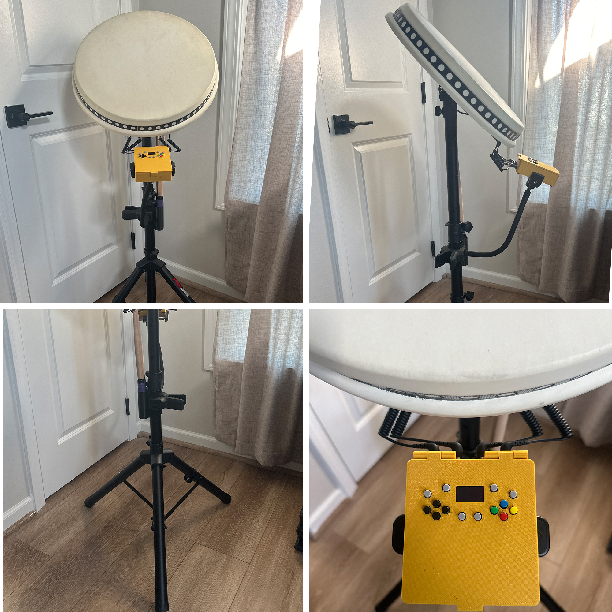
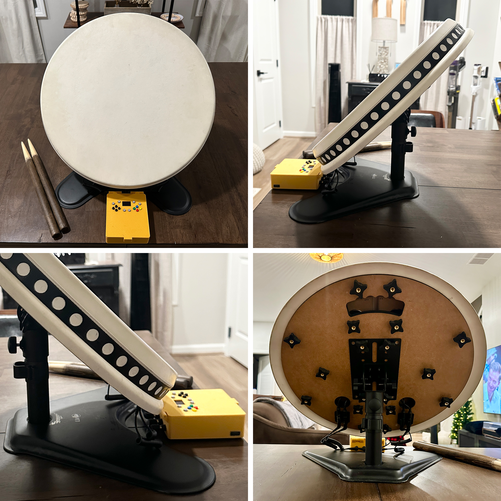
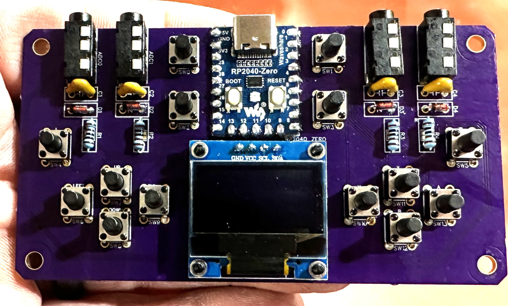
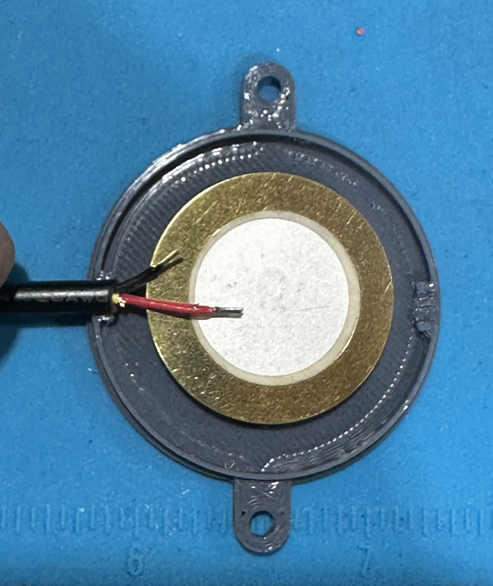
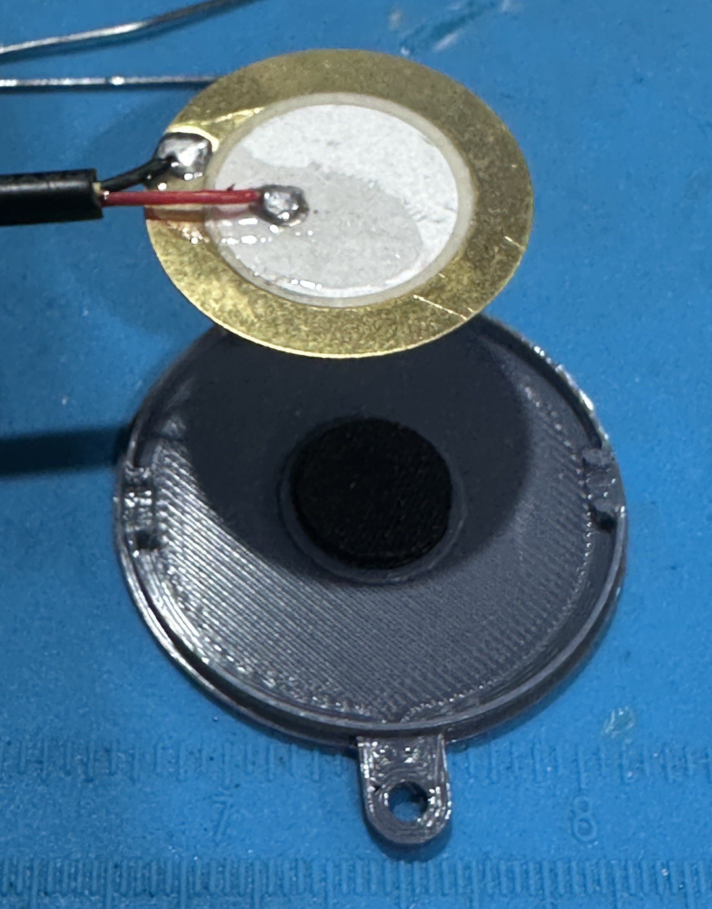
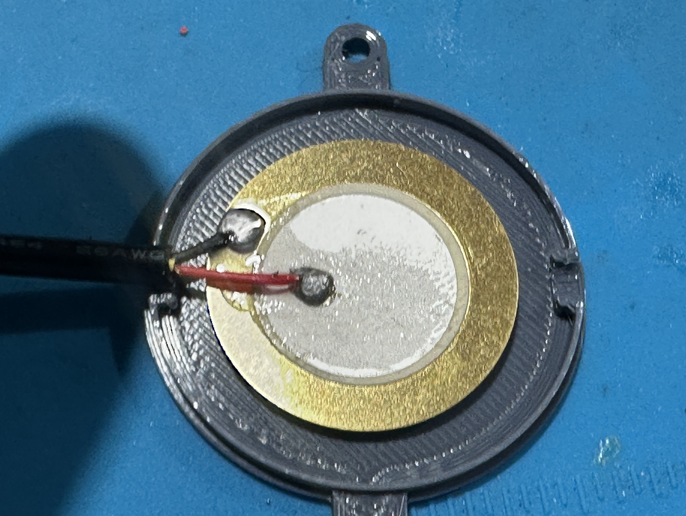

---

*In Japanese, 'ouchi' means 'home' and 'taiko' means 'drum.' Together, 'OuchiTaiko' represents the joy of bringing the arcade Taiko experience into your own space.*

---

# **Table of Contents**
- [1: Project Overview](#1-project-overview)
- [2: Parts List for Electronics](#2-parts-list-for-electronics)
- [3: Parts List for Hardware](#3-parts-list-for-hardware)
- [4: Assemble the Control PCB](#4-assemble-the-control-pcb)
- [5: Build the Drum](#5-build-the-drum)
- [6: Control Box Connection](#6-control-box-connection)
- [7: Flash the Firmware](#7-flash-the-firmware)
- [8: Calibration & Settings](#8-calibration--settings)
- [9: Files & Downloads](#9-files--downloads)
- [10: Basic Troubleshooting](#10-basic-troubleshooting)
- [11: Menu System Reference](#11-menu-system-reference)
- [12: About](#12-about)
- [13: Copyright Information](#13-copyright-information)

---

# **1: Project Overview**

#### The Finished Build:
When you complete this guide, you will have a full arcade-style Taiko drum and controller setup in either **Floor-Standing Tripod Mode** or **Table-Top Mode**.

 

<i>Or Table-Top Mode...</i>

 

---

Hi, I'm KillerQ, creator of the **OuchiTaiko Project** - an open-source build guide for a professional arcade-style Taiko drum controller.

This project is the result of over a year of research and development focused on solving the high cost and limited availability of commercial Taiko controllers. Using **Adaptive Baseline Software Intelligence (ABSI)**, a custom through-hole control PCB, and a mechanically isolated sensor system, OuchiTaiko delivers arcade-grade performance with approachable DIY assembly.

All you need is basic soldering and woodworking skill. The linked parts are known to work together, though compatible alternatives are welcome.

This guide is intentionally thorough. The goal is simple: **less guessing, more building**.

---

# **Key Features**

## **World-First Innovations**

Traditional Taiko controllers often require constant trial-and-error threshold tuning, firmware recompiles, or compromise between sensitivity and false triggers.

**OuchiTaiko solves that with three core ideas:**

1. Auto Calibration
2. Adaptive Baseline Analysis
3. Custom Sensor Housing

### **1) Auto Calibrate**
OuchiTaiko can be tuned quickly using the included HTML calibration workflow.

- no recompiling required
- easier crosstalk diagnosis
- quick threshold refinement
- easy retesting after hardware changes

### **2) Adaptive Baseline Software Intelligence (ABSI)**
ABSI improves stability through software instead of overcomplicated analog design.

- automatic sensitivity adjustment based on environmental noise
- dynamic baseline tracking for changing conditions
- stable long-term behavior without drift

### **3) Custom Arcade Sensor Suspension**
The sensor housings and mounting system improve mechanical isolation and consistency.

Benefits include:

- more consistent trigger response
- reduced mechanical crosstalk
- cleaner hit detection
- strong long-term durability

---

## **Complete Hardware & Features**

### **Standalone Testing & Display**

No PC is required just to verify the controller works.

- OLED display with live feedback
- visual confirmation of all 14 navigation buttons
- live hit display and mode display
- instant wiring verification with USB power only

### **Professional Hardware**

- custom PCB designed specifically for this project
- 14 navigation buttons for full game control
- adjustable drum mounting options
- dedicated sensor inputs for all 4 drum lanes

### **Controller Modes**

- Nintendo Switch Tatacon
- Nintendo Switch Pro Controller
- Sony PS3 Dualshock3
- Sony PS4 Tatacon
- Sony PS4 Dualshock4
- Keyboard Player 1
- Keyboard Player 2
- Xbox 360 (XInput)
- Android (XInput)
- iOS (XInput)
- Analog Player 1
- Analog Player 2
- MIDI Controller
- Web Calibrate

### **Zero Coding Required**

- drag-and-drop firmware flashing
- on-device menus
- no recompiling for normal setup
- no programming knowledge required

---

### **Demo Video**

- [Gameplay](https://youtu.be/p4eFeo_LB5I?si=jDKb93B7uYx1qAux)

---

# **2: Parts List for Electronics**

<a href="#table-of-contents">-Back to Top-</a>

These linked parts are known to work together as tested.

| Item | Pieces Needed | Product Link |
| --- | --- | --- |
| Waveshare RP2040-Zero | 1 | [Link](https://www.amazon.com/dp/B09SBCKYSC) |
| 1N4148 diodes | 4 | [Link](https://www.amazon.com/dp/B0DN62QFYS) |
| 0.1uF / 100nF ceramic capacitors | 4 | [Link](https://www.amazon.com/dp/B08B3VCK42) |
| 3.5mm female audio jack, board mount, 4-pin PJ-320A | 4 | [Link](https://www.amazon.com/dp/B07KY862P6) |
| 3.5mm TRS male plugs with flying leads | 4 | [Link](https://www.amazon.com/dp/B0D72TV7Y5) |
| 1K ohm resistor, 1/2W | 4 | [Link](https://www.amazon.com/dp/B0FP1YFMVM) |
| 27mm piezo sensors | 4 | [Link](https://www.amazon.com/dp/B07RK2TQ8D) |
| 128x64 mono OLED display (I2C) | 1 | [Link](https://www.amazon.com/dp/B09T6SJBV5) |
| 6mm x 6mm x 9mm tactile switches with caps | 14 | [Link](https://www.amazon.com/dp/B07VQF8P2Y) |
| 6 inch coiled 3.5mm TRS extension cable (male to male) | 4 | [Link](https://www.amazon.com/dp/B0D7CXJ5LQ) |
| 3.5mm TRS barrel coupler | 4 | [Link](https://www.amazon.com/dp/B07YSCGBL7) |
| 6ft USB-A to USB-C cable | 1 | [Link](https://www.amazon.com/dp/B0CKXZML11) |

---

# **3: Parts List for Hardware**

<a href="#table-of-contents">-Back to Top-</a>

## **Required Tools and Supplies**

1. Laser cutter or CNC machine, or another cutting method
2. Soldering iron and solder
3. Wire strippers / cutters
4. Screwdrivers
5. Hot glue gun
6. Strong clamps
7. Drill
8. Router
9. Sandpaper
10. Utility knife
11. Rubber mallet

## **Hardware Parts List**

| Item | Pieces Needed | Product Link |
| --- | --- | --- |
| 1/4" (6mm) 2ft x 4ft cabinet-grade MDF | 2 | [Home Depot](https://www.homedepot.com/p/1-4-in-x-2-ft-x-4-ft-Medium-Density-Fiberboard-1508104/202089069) |
| 1/4" x 1-1/2" OD stainless steel fender washers | 46 | [Link](https://www.amazon.com/dp/B0D8ZRL1CP) |
| Wood glue | 1 | [Link](https://www.amazon.com/dp/B0002YQ378) |
| M3 x 8mm bolts | 8 | [Link](https://www.amazon.com/dp/B07CMQ1SQH) |
| M3 x 5mm threaded inserts | 8 | [Link](https://www.amazon.com/dp/B0CLKCQ2SH) |
| M6 x 10mm wood threaded inserts | 14 | [Link](https://www.amazon.com/dp/B0CNLRFFH1) |
| M6 x 35mm nylon bolts | 14 | [Link](https://www.amazon.com/dp/B07L9ZS21T) |
| M6 threaded 20mm x 15mm rubber isolators | 14 | [Link](https://www.amazon.com/dp/B0BKPHT6Y9) |
| PLA filament | 1 | [Link](https://www.amazon.com/dp/B081S5N5PC) |
| Gel superglue | 1 | [Link](https://www.amazon.com/dp/B0006HUJCQ) |
| Medium thread adhesive / Loctite | 1 | [Link](https://www.amazon.com/dp/B000FIXQXK) |
| 2.2mm scuba knit neoprene fabric | 1 | [Link](https://www.amazon.com/dp/B0DK1B5LZ7) |
| Finger knobs with pass-through M6 threads | 18 | [Link](https://www.amazon.com/dp/B07RW9ZH4H) |
| Mini PA speaker tripod stand (optional) | 1 | [Link](https://www.amazon.com/dp/B094N9YG72) |
| Desktop monitor stand (optional) | 1 | [Link](https://www.amazon.com/dp/B072QDMRS8) |
| Adjustable angle speaker bracket | 1 | [Link](https://www.amazon.com/dp/B0DR8NCZP6) |
| Spring-loaded phone holder with gooseneck arm (optional) | 1 | [Link](https://www.amazon.com/dp/B0F32MLBZX) |
| Rubber Taiko drum cover (optional, but strongly recommended) | 1 | [Link](https://taiko.ac/products/rubber-drum-pad) |
| 1/4" roundover router bit | 1 | [Link](https://www.amazon.com/dp/B0C5DVBNLS) |
| Clear spray glaze / lacquer | 1 | [Link](https://www.amazon.com/dp/B00D0293SA) |
| Deburring tool (optional) | 1 | [Link](https://www.amazon.com/dp/B07RM1D6WD) |

---

# **4: Assemble the Control PCB**

<a href="#table-of-contents">-Back to Top-</a>

## **Control PCB Overview**

The custom PCB combines the controller logic, display wiring, navigation buttons, and drum input network into one compact board.

The components you will be soldering to the board are:

- **1x Waveshare RP2040-Zero**
- **14x tactile buttons**
- **4x 1N4148 diodes**
- **4x 1K resistors**
- **4x 0.1uF ceramic capacitors**
- **1x I2C OLED**
- **4x 4-pin PJ-320A 3.5mm female TRS jacks**

## **Recommended Assembly Order**

### **Step 1: Solder the passive parts**

Install:

- `R1-R4` = `1K resistor`
- `C1-C4` = `0.1uF capacitor`
- `D1-D4` = `1N4148 diode`

For the diodes, the black band **must** match the board silkscreen / cathode marking. On this board, that means that the black band will be oriented to the LEFT when looking from the top down from above the board face.

### **Step 2: Solder the 14 buttons**

Install all 14 navigation buttons in their labeled positions.

The button legs and PCB holes are rectangular, not square, so be sure the buttons are oriented to match the footprint. They will work either direction as long as the rectangular pin layout matches the board. For this board, the rectangular orientation is going up and down.

Make sure each button sits flat before soldering all 4 legs.

### **Step 3: Mount the OLED**

Install the OLED onto the display footprint.

If you bought the recommended OLED, the pins will line up directly as:

- `GND`
- `VCC`
- `SCL`
- `SDA`

Confirm the pin order before soldering.

### **Step 4: Install the TRS drum input jacks**

Install the 4 female TRS drum input jacks. Due to the pin layout, there's only one way they will fit.

### **Step 5: Mount the RP2040-Zero**

Install the **Waveshare RP2040-Zero** carefully and keep it straight. The firmware expects this exact module footprint and pinout. You do not need to solder the inner-board pads on the Waveshare - just the 20 perimeter Castellated holes.

Soldering Castellated holes may seem tricky at first, but it's actually easier to many!

Here is a timestamped link that will help explain this process: - [Castellated Soldering](https://youtu.be/rGvvwXrv310?t=312)

## **Inspect Your Work**

Before powering on, confirm all of the following:

- the RP2040-Zero is aligned correctly
- the OLED pins are in the correct order
- all 14 buttons are soldered
- all 4 drum lanes have their resistor, capacitor, and diode installed
- there are no visible solder bridges
- all joints look solid

Firmware flashing is covered later in **Step 7**.

---

# **5: Build the Drum**

<a href="#table-of-contents">-Back to Top-</a>

**Important Scale Notice:** The SVG files provided in the download are the correct scale and should **NOT** be resized. The drum dimensions are precisely calculated to work with the sensor housings and other non-scalable components. If you try to make the drum smaller, other parts will not fit later in the project.

💡 **Scale Verification:** Before cutting, verify the SVG files are at correct scale by checking the shapes in the SVG file against the listed dimensions noted in the KEY section of that same SVG file. 

**No laser cutter or CNC access?** No worries - there are other options. Ask a friend, local shop, or check if your area has a Makerspace. Alternatively, you can print the SVG files full-size across multiple sheets of paper (ensure your printer is set to 100% scale / "Actual Size"), and then overlay the paper on your wood as a template.  You would then cut and drill by hand. Double check that your printed templates are sized properly before cutting or drilling anything.

---

## **5.1: Prepare the Wood**

### **Cut all MDF wood pieces per SVG templates**

💾 [SVG Template packet located here](#9-files--downloads)

Use your laser or CNC machine (or the method available to you) to cut out all of the wood components in the template files.

- You'll be printing one set of upper faceplates
- You'll be printing one set of lower faceplates
- You'll be printing 2x identical baseplates

---

### **Sand smooth as needed**

Sand down any rough edges and surfaces from the cutting step, and wipe off sawdust to prepare for gluing.

---

## **5.2: Assemble the Drum Structure**

### **Glue the rear baseplates together**

Use **wood glue** to glue the two identical rear baseplates together (they are 100% identical, just align the holes and glue together). Clamp securely or weigh down and let dry for several hours. You can also temporarily insert some 6mm bolts into the holes to ensure the two plates remain exactly aligned. Until the glue really starts to set, periodically check the plates to make sure no shifting has occurred - if so, re-align and clamp harder.

Leave the clamps and weight on for at least 6 hours. Let the glue fully cure for 24 hours before continuing past the gluing steps.

---

### **Assemble and glue the drum faceplates together**

There will be 4 finished drum faceplates that you will be assembling during this step: Left Ka, Left Don, Right Don, and Right Ka. Each faceplate consists of TWO pieces - a smooth TOP plate along with a corresponding BOTTOM plate with holes in it.

**For Ka Plates:**

Let's start with the Ka plates - specifically, the Left Ka. You will be using the Left Ka TOP and the Left Ka BOTTOM plate.

Apply wood glue to the underside of the top Ka plate and apply wood glue to the topside of the lower Ka plate. Press the two pieces together and clamp or weigh them down. Until the glue really starts to set, periodically check the plates to make sure no shifting has occurred - if so, re-align and clamp harder. Leave the clamps and weight on for at least 6 hours. Let the glue fully cure for 24 hours before continuing past the gluing steps.

**Repeat this exact same process for the Right Ka.**

**For Don Plates:**

Apply wood glue to the underside of the top Don plate and apply wood glue to the topside of the lower Don plate (don't forget, each piece is exactly the same in this step only, so it is up to you which is the top part and which is the bottom part). Press the two pieces together and clamp or weigh them down. Until the glue really starts to set, periodically check the plates to make sure no shifting has occurred - if so, re-align and clamp harder. Leave the clamps and weight on for at least 6 hours. Let the glue fully cure for 24 hours before continuing past the gluing steps.

**Repeat this exact same process for the Right Don.**

When complete, you will have 4 faceplates - each consisting of a top half and a bottom half.

---
### **Sand all Don, Ka, and Baseplate Edges**
- Sand any extra glue off of the surfaces of the drum and
- Be EXTRA sure to sand off any excess glue that has dripped out of the edges/seams.  This will ensure a clean, uniform surface to work with.

---
### **Rout/Chamfer all Don Ka rim edges**

Using a router and a 1/4" roundover bit, rout down every edge on the top and bottom of all glued pieces. If you don't have a router, you can use a deburring tool to lightly shave off the outer edges on the Don and Ka pieces.  Sandpaper can also achieve a similar effect.

This procedure helps prevent stick damage and wear and tear on your drum and cover, as well as gives your drum a professional, clean look by softening/rounding down all of the sharp, 90 degree edges.

---

### **Spray All Wood With Clear Lacquer**
You may now spray several coats of Clear Lacquer Spray Paint to the front back and sides all wood pieces.  This will help protect and seal the wood and reduce wear and tear.  Spray a single coat, let sit for 45 minutes.  Spray two more coats in a similar manner.  Let dry completely for 4 hours after the final coat before continuing.

---

### **Drill Holes For Threaded Inserts**

The following step allows the drum to be built with no visible mounting holes on the drum face. This improves aesthetics and reduces wear on sticks and the drum cover. You will drill holes into the underside of the top faceplates so the threaded inserts for the grommets can be installed from beneath and remain invisible.

The hols you will be workin with are on the underside of the bottom Drum Face Plates.

Using a Drill press, insert a **9mm** diameter drill bit (or the specialized drill bit that came with your threaded wood inserts), and set it up so that when you drill press is fully lowered, the bottom of the drill bit is exactly 2mm above your drill press plate/table.  This way, you can ensure that every time you lower the drill press, you're getting the exact depth needed each time.

If you don't have a drill press, and only have a standard drill, that's still ok.  In that case, measure the exact thickness of your Don and Ka Plates (should be 12mm-13mm) and subtract 2mm from that measurement and mark that new, lower number on your 9mm drill bit with a piece of tape. 

For example, if your Plates are exactly 13mm thick, take a piece of tape and put it on your drill bit so that the bottom edge of the tape is at exactly 11mm from the tip of the drill bit.  You'll simply drill down until the bottom of the tape is at the surface of your plate.  It is suggested to practice holes on a scrap piece of wood to make sure you have the hang of it, and that everything is working as planned.

Now that your drill depth is set, locate the 14 pre-cut **9.5mm** holes located on the underside of the top plates where the rubber grommets will go - you will be using those holes as a drill guide.

Carefully Drill **straight** down into those 9.5mm holes and turn them into new **9.5mm wide x 11mm deep** holes (or whatever your calculated depth was). **Repeat this for all 14 similar holes.**

---

### **Chamfer/Bevel holes**

Using a Deburring tool, Chamfer/Bevel the (inner) rim of each of the 14 holes you just drilled hole so that the tapered head of the threaded inserts will tighten down flush and feel smooth when your fingers pass over them. This chamfering can be done with a sharp screwdriver or a sharp knife if you don't have a deburring tool. 

Additionally, if you have a drill press, or you can actually just strist the drill bit using your hand, you can use an 11mm drill bit and drill straignt down intop the top of your new 9.5mm holes for the depth of ONLY anout 1-2mm.  this will create a chamfered rim just the same as the above steps.

Make sure you repeat this exact same process for all 14 holes.

---

### **Install the M6 threaded inserts**

Screw in the **14 individual M6 threaded wood inserts** into the corresponding holes until flush (add a drop of **Superglue** to the *outside* of threads to help permanently secure them to wood).  

If you feel that your threaded insert won't go flush, deburr a little more material to make the taper in the wood larger.

It is absolutely crucial that these threaded inserts are flush or JUST below the surface to ensure that the grommets in future steps will sit flush.

---

### **Install M3 threaded inserts into wooden faceplates**

Each faceplate has **two  4.5mm holes on the underside** where sensor housings will mount using M3 threaded inserts.  You'll be inserting a total of 8 M3x3mm threaded inserts

**Installation:**

Place a small drop of superglue on the outer edge of each M3x3 threaded insert before you install it.  Rest the insert on top of the 4.5mm hole with the narrow side down, and make sure the insert is level.

Using a hammer or rubber mallet, tap the insert into the wood until it's perfectly flush with the surface.  **Two M3x3mm threaded inserts** will be installed beneath each Don and Ka Top Plate.

This is how it will look when all M6 and M3 threaded inserts are installed:

---
### **Prepare The Stainless Steel Mounts**

The Official Taiko no Tatsujin Arcade Drum Controllers use large, machine-cut steel metal plates mounted to the rear of the wooden faceplates.  These metal plates add rigidity which, in turn, help absorb vibration, improve stick feedback, as well as help dampen the sound.  My original design for this project included plans to make your own metal plates, but that required heavy machinery which was extremely impractical and dangerous, not to mention, Steel plates can get very expensive.

I wouldn't let that stop me from creating the proper Arcade experience, however. I knew I needed to design a new method - a method that would replicate ALL of the benefits and feeling of the Steel Arcade Plates, without actual typical Steel Plate method.  After a few days of brainstorming, was able to create a solution that replaces the Steel Plates while retaining 100% of their benefit.

The 1/4" x 1-1/2 OD" Stainless Steel Fender Washers mounts you will be constructing in this next step is my perfect solution.  

You will still get the true arcade benefits of rigidity, vibration absorption, improved stick feedback, and sound dampening without ANY of trouble of using actual steel plates...and for only a few dollars!

**Prepare the Stainless Steel Washer Stacks:**

(Note, the washers may have one side that is slightly sloped/rounded, if so, make that the top face and orient them all the same)

1. Use rubbing alcohol to clean the top and bottom surfaces of 42 1/4" x 1-1/2 OD" Stainless Steel Fender Washers .

2. Each stack will consist of 3 washers superglued together to make a single unit.

   

   
   

3. Place 3 drops of superglue on top of one of the washers.

   

   
   

4. Place another washer on top of the glue dots.  Hold the stack of two washers in your fingers and press them together for 30 seconds, making sure the edges stay evenly aligned.

   

   
   

5. Place 3 drops of superglue on top of the new stack of two washers that you just fastened together.  Place the third washer on top of those new glue dots.

   

   
   

6. Hold the new stack of three washers in your fingers and press them together for 30 seconds, making sure the edges stay evenly aligned.  This stack is complete, set it to the side.

   

   
   

7. Repeat this until you have 14 stacks of 3 washers superglued together.

   

   
   

8. Set these stacks off to the side and let them cure for at least 30 minutes while you assemble the rubber isolators in the next step.

   

## **5.3: Assemble The Rubber Isolators**

### **Cut nylon bolt head**

1. Measure 20mm of length on one of the 35mm Nylon Bolts.
2. Using a pair of cutters, cut and discard the remining portion of the bolt that has the head attached.  We will only be using the straight 20mm bolt portion for this project.
3. Repeat this process until you have 14 20mm bolts.

---

### **Apply Loctite to isolator**

Apply one drop or less of **Loctite** to threads on the inside of the rubber isolator threaded hole.

---

### **Install bolt in isolator**

Screw one end of the 20mm bolt into isolator until it stops.

---

### **Apply Loctite to drum plate inserts**

Add one drop or less of **Loctite** to inside threads of the M6 threaded inserts on the bottom face of the drum plates.

---

### **Install isolator/Steel Washer assemblies**

(<a href="[URL_GOES_HERE](https://youtu.be/N6h3QC_hvl8?si=WZEyYCb-pd2_z-tV)">HERE</a> is a timelapse video demonstrating how to mount the Isolators and Washers to to the faceplate)

1. Place a washer stack over one of the 6mm threaded insert holes on the bottom of one of the faceplates.

   

   
   

2. Feed the nylon end of the Isolator through the washer stack, and into the threaded insert.  Finger tighten and ensure that the washers do not move/spin and that there's no gap between the wood and the washers, or the washers and the grommet.

   

   
   

3. This is how the sideview of the assembled Isolator/Washer set should look.  If there is a gap, ensure that the 6mm threaded insert is in fact flush to the wood surface.  If the washer stack IS flush, and a gap still remains, unscrew the nylon bolt from the wood, and carefully cut off an additional 1mm of length, and try again.  Repeat if necessary, only removing the smallest amount of bolt needed until everything is flush and snug.

   

   
   

4. Repeat this step for all 14 mounting holes.

   

   
   

---

## **5.4: Print Sensor Housings**

### **Print The Sensor Housings**

💾 [Sensor Housing files are in the file packet here](#9-files--downloads)

Print 4 complete sets of Sensor Housings (each set has a top and bottom).

Use **PLA filament**.

**Printer Settings:** 0.2mm layer height, 40% Gyroid infill, no supports needed.

---

## **5.5: Assemble Sensor Electronics**

🎥 [Video overview of sensor housing assembly](https://youtu.be/tQe-xDEqEdY)

### **Cut neoprene discs**

Cut four **12mm neoprene discs** by using the SVG template.

💾 [Neoprene Disc Template Files are in the file packet here](#9-files--downloads)

---

### **Glue neoprene disc to housing**

Place several drops of **Superglue** into the raised center ring in the bottom shell of the housing. Place a single neoprene disc in this ring on top of the glue. Press lightly for 30 seconds.

---

### **Prepare end of TRS Wire**

Cut the ends of your TRS wire so that they are approximately 10mm for the red and approximately 8mm for the black.  The difference in lenght is because you want them to be slightly offset as in this photo: 

---

### **Solder to Piezo**

Now solder the **red** wire to piezo center disc, and solder the **black** wire to outer brass ring. The video linked at the beginning of this section illustrates how to do this properly.

---

### **Glue Piezo to Neoprene Mount**

Add several drops of **Superglue** onto the top surface of neoprene that is already glued to the bottom housing shell. Center the **piezo sensor** face up (the all-brass side faces *down*, your wires will be on the top) onto the neoprene. Press lightly for 30 seconds. Be sure that the wire is laying across the strain relief channel portion on one side of the bottom housing channel.

💡 **Note:** Pic varies slightly from your version - this was an earlier version. You will have a more pronounced strain relief channel.

---

### **Enclose Housing**

Add a drop of **Superglue** to the strain relief channel *below* the wire, as well as on top, and add a few drops to the upper housing around the inside rim. Now assemble the top and bottom housing pieces together, press and hold for 30 seconds. The top shell of the housing will nest into place when aligned properly.

#### **Repeat these steps so that you end up with 4 complete sensor assemblies**

---

### **Mount the Sensor Housings to The Drum**

(Here is a timelapse video demonstrating how to mount the sensor housing to the faceplates)

Mount your 4 completed housings to the underside of drum faces using **two M3x8mm screws** for each housing and screwing them into the threaded inserts. Be sure that the bottom of the housing (the side with the neoprene disc glued to it) is flast against the wood.

Tighten snug so that the sensor housing is firmly pressed against the wood - but don't over-tighten.

Repeat this for each Don and Ka faceplate.

---

## **5.6: Mounting Hardware And Faceplates**

### **Mount Adjustable Speaker Plate**

1. Place your **speaker bracket** against the rear/bottom of your baseplate so aligns with the 4 pre-cut mounting holes.

2. Feed **Four M6x16 bolts** though a single 1/4" x 1-1/2 OD" Stainless Steel Fender Washer and then through the four mounting holes on the baseplate so that they come out through the speaker mounting plate holes.  Use 4 M6 knobs to tightly secure the mounting plate against the rear of the Drum

---

### **Assemble Drum Faceplates to Rear Baseplate**

(Here is a timelapse video demonstrating how to mount the faceplates to the baseplate)

Now assemble the rest of the drum structure by feeding the 14 **M6x18 bolts** on the bottom of the 4 drum faces through baseplate holes of the rear baseplate. Be sure to route the sensor wires through the nearest, round cut-out in the baseplate.

---

### **Attach TRS barrel mounts**

💾 [Barrel Mount Files are in the file packet here](#9-files--downloads)

1. Carefully flip the partially assembled drum over so that the drum faces dont fall out.
2. 3D Print and Attach **TRS barrel mounts** with adhesive tape as seen in picture.

2. Place the four TRS couplers in the mounts. You will have one pair of Barrel Mounts on each side of the drum.
3. Attach the sensor wires to the top of their respective Barrel Connector

---

### **Attach the 6mm Knobs**

Attach a 6mm knob to all of the exposed bolts and tighten finger tight.  Now all 4 faceplates are securely fastened to the baseplate.

### **Connect Control Box Extension cables**

Connect the ends of the coiled 3.5mm extension cables to the bottom of the Barrel Connectors.  These extension cables will eventually plug into the female TRS jacks on your Control Box. 

---

# **6: Control Box Connection**

<a href="#table-of-contents">-Back to Top-</a>

## **6.1: Floor Stand Mode**

### **Mount drum to speaker stand**

Attach the drum and bracket to the speaker stand.

### **Mount control box and connect signal wires**

Mount the control box to the phone holder arm and connect the drum TRS plugs to the matching control box TRS jacks.

## **6.2: Table-Top Mode**

### **Cut monitor stand tubing**

Shorten the monitor stand tube until the drum height feels right for your desk. The example shown is around `150mm`.

### **Place control box and connect wires**

Position the control box on the table and connect the drum signal wires.

### **Add drum cover**

Install an arcade drum cover if possible. Because the drum matches arcade diameter, official-style covers fit properly.

If needed, you can experiment with other materials such as:

- thin foam
- towel
- blanket
- mouse pad

Thresholds can always be adjusted later to match the cover you choose.

### **Adjust height and angle**

Set the final angle and height for comfort.

---

# **7: Flash the Firmware**

<a href="#table-of-contents">-Back to Top-</a>

💾 **Download the firmware files:**
- [OuchiTaiko Firmware](#9-files--downloads)
- [Flash Nuke](#9-files--downloads)

## **Step 1: Enter Bootloader Mode**

Hold the **BOOT** button on the RP2040-Zero while connecting it to your PC. The board should appear as a removable `RPI-RP2` drive.

## **Step 2: Wipe the Board**

It is good practice to flash `universal_flash_nuke.uf2` before flashing the main firmware, especially when switching between builds.

1. Drag `universal_flash_nuke.uf2` onto the drive
2. Let the board reboot
3. Repeat once more if you want a completely clean start

## **Step 3: Flash the Firmware**

Drag the OuchiTaiko `.uf2` firmware file onto the drive.

After the copy finishes, the board should automatically reboot into controller mode.

If it does not reboot on its own, wait a few seconds, unplug it, and reconnect it.

---

# **8: Calibration & Settings**

<a href="#table-of-contents">-Back to Top-</a>

## **Quick Hardware Check**

Before calibration:

1. Power the controller over USB
2. Verify the OLED turns on
3. Tap each drum lane and confirm you see hit feedback
4. Press each navigation button and confirm the correct label appears

## **Auto Calibrate - Recommended Method**

By default, the controller boots into **Web Calibrate** Controller mode. (you'll read below how to change to a standard controller mode after initial web calibration)

The recommended calibration workflow uses the **downloaded HTML calibration page**.

### **Workflow**

1. Power on the controller
2. Open the downloaded HTML calibration page in **Chrome or Edge**
3. Connect the controller over USB
4. Test each drum lane
5. If another lane triggers, raise the threshold of the falsely triggered lane
6. Repeat until each lane hits cleanly

### **Why use it?**

- live hit feedback
- easy crosstalk testing
- quick threshold adjustment
- no reflashing needed

## **Manual Threshold Adjustment**

Use **Manual Thresholds** to fine-tune settings after testing in the HTML calibration page.

### **Access**

1. Hold **SELECT** for 1 second
2. Go to **Drum Tuning**
3. Select **Manual Thresholds**

### **Layout**

`KL   DL   DR   KR`

### **Controls**

| Button | Action |
| --- | --- |
| **LEFT / RIGHT** | Select drum |
| **UP / DOWN** | Adjust threshold |
| **A (EAST)** | Save |
| **B (SOUTH)** | Cancel |

### **Threshold Guide**

- lower value = more sensitive
- higher value = less sensitive
- range = `0-4095`

## **Controller Mode Selection**

Open the menu, select **Controller Mode**, choose the desired mode, and confirm with **A**. The controller will reboot automatically when the mode changes.

Available modes:

- Switch Tatacon
- Switch Pro
- PS3 Dualshock3
- PS4 Tatacon
- PS4 Dualshock4
- Keyboard Player 1
- Keyboard Player 2
- Xbox 360
- Android
- iOS
- Analog Player 1
- Analog Player 2
- MIDI Controller
- Web Calibrate

---

# **9: Files & Downloads**

<a href="#table-of-contents">-Back to Top-</a>

Add your file packet links here:

- firmware `.uf2`
- `universal_flash_nuke.uf2`
- SVG templates
- sensor housings
- barrel mounts
- neoprene template
- HTML calibration page

---

# **10: Basic Troubleshooting**

<a href="#table-of-contents">-Back to Top-</a>

### **OLED does not turn on**
- check OLED pin order
- inspect solder joints
- confirm the RP2040-Zero is installed correctly

### **A drum lane does not register**
- check piezo solder joints
- confirm the TRS wiring
- verify the lane components are populated on the PCB
- confirm the sensor jack is fully inserted

### **A lane causes false hits on another lane**
- switch to **Web Calibrate**
- use the HTML calibration page
- raise the threshold of the falsely triggered lane
- retest

### **Board does not appear as `RPI-RP2`**
- reconnect while holding **BOOT**
- try another USB cable
- try another USB port

---

# **11: Menu System Reference**

<a href="#table-of-contents">-Back to Top-</a>

## **Quick Access**

- Hold **SELECT** for about 1 second to open the system menu

## **Navigation Controls**

| Button | Action |
| --- | --- |
| **LEFT / RIGHT** | Navigate menu items or move between threshold fields |
| **UP / DOWN** | Adjust selected threshold |
| **EAST (A)** | Confirm / save |
| **SOUTH (B)** | Back / cancel |

## **Main Menu**

- Controller Mode
- Drum Tuning
- Advanced
- USB Flash Mode
- About

## **Drum Tuning**

- Auto Calibrate
- Manual Thresholds
- Reset Thresholds

## **Advanced**

- Reset ALL Settings
- Hold Time (Debounce)

## **Idle Screen**

When not in the menu, the OLED shows:

- current controller mode
- live drum hit feedback
- button press indicator
- menu hint text

---

# **12: About**

<a href="#table-of-contents">-Back to Top-</a>

This project builds on the work of several excellent open-source projects and community members.

The original firmware base, menu logic, and OSD direction were adapted from **[DonCon2040](https://github.com/ravinrabbid/DonCon2040)** by **ravinrabbid**.

Circuit inspiration came from **[HIDtaiko](https://github.com/kasasiki3/HIDtaiko/tree/master)** by **kasasiki3**.

Additional thanks:

- **Gadgetoid** for [pico-universal-flash-nuke](https://github.com/Gadgetoid/pico-universal-flash-nuke)
- **Dork Design** for the customizable control box resource
- **Allspice** for early build feedback from a beginner-builder perspective
- **Moshir** for helping review the guide for clarity and flow

Useful community resources:

- [Taiko no Tatsujin Modding Discord](https://discord.com/invite/HFm37aA5zr)
- [Cons&Stuff :) Discord](https://discord.gg/qEpzyvf8DY)
- [OpenStick Community / GP2040-ce Discord](https://discord.com/invite/openstickcommunity-1049366310389289001)

## **Closing Thoughts**

Thanks for taking the time to build OuchiTaiko.

If you have project-specific questions or suggestions, use the GitHub Discussions page. You can also ask in the Discord communities above.

### **Spread the Word**

If you build one, share it. Tag me (`KillerQ97`) if you post your results.

Enjoy, have fun, and peace out.

[www.ouchitaiko.com](https://www.ouchitaiko.com)

---

# **13: Copyright Information**

<a href="#table-of-contents">-Back to Top-</a>

## **Attribution Chain**

- **Original DonCon2040 firmware:** (c) ravinrabbid (MIT License)
- **HIDtaiko components:** (c) kasasiki3 (Apache License 2.0)
- **Custom modifications and features:** Created by KillerQ

**Copyright (c) 2025 KillerQ**

## **Legal Compliance Notice**

Any distribution of this firmware, binary or source, must include:

1. the MIT license from DonCon2040
2. the Apache 2.0 license from HIDtaiko
3. copyright notices from both upstream projects
4. attribution to contributors

Repository license files:

- [LICENSE-MIT](LICENSE-MIT)
- [LICENSE-APACHE](LICENSE-APACHE)

## **Summary**

This project is transparent about its licensing and gives full credit to the upstream projects that made it possible.

Thank you to ravinrabbid and kasasiki3 for their open-source work.

**KillerQ**

[www.ouchitaiko.com](https://www.ouchitaiko.com)

---

*OuchiTaiko Project | Smarter. Simpler. Better.*